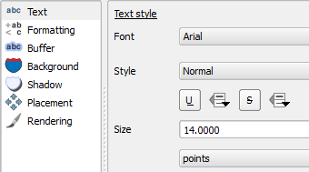
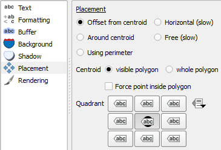
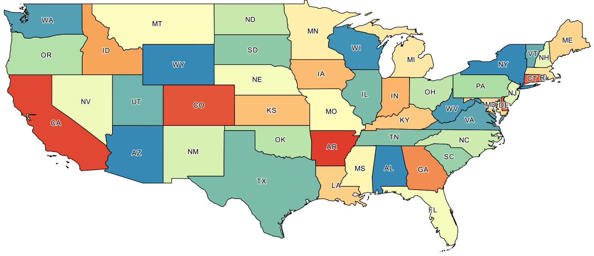

# GST 104: Cartographic Design
## Lab 1: Creating a Colorful Map of the United States of America
### Objective – Explore and utilize style properties in QGIS to design a colorful map of the United States of America

Document Version: 5/14/2015

**FOSS4G Lab Author:**
Richard Smith, Ph.D., GISP
Texas A&M University - Corpus Christi

**Original Lab Content Author:**
Richard Smith, Ph.D., GISP
Texas A&M University - Corpus Christi

---

The development of the original document was funded by the Department of Labor (DOL) Trade Adjustment Assistance Community College and Career Training (TAACCCT) Grant No.  TC-22525-11-60-A-48; The National Information Security, Geospatial Technologies Consortium (NISGTC) is an entity of Collin College of Texas, Bellevue College of Washington, Bunker Hill Community College of Massachusetts, Del Mar College of Texas, Moraine Valley Community College of Illinois, Rio Salado College of Arizona, and Salt Lake Community College of Utah.  This work is licensed under the Creative Commons Attribution 3.0 Unported License.  To view a copy of this license, visit http://creativecommons.org/licenses/by/3.0/ or send a letter to Creative Commons, 444 Castro Street, Suite 900, Mountain View, California, 94041, USA.

This document continues to be modified and improved by generous public contributions.

---

### 1. Introduction

In this lab, the student will explore and utilize style properties in QGIS Desktop to create a colorful map of the United States of America (USA).  QGIS is a free and open source geographic information system software package that can be used to visualize, query, and analyze spatial information.

This lab will focus primarily on setting style properties to create an attractive, colorful map of the USA.  Throughout the lab, the student will create three maps: one of the lower 48 states, one of Alaska, and one of Hawaii.  In the next two labs, these three maps will be refined and completed to create the final map.

This lab includes the following tasks:

+ Task 1 – Designing the Lower 48 Map
+ Task 2 – Basic Labeling of States
+ Task 3 – Saving and Loading QGIS Layer Style Files
+ Task 4 – Designing the Alaska Map
+ Task 5 – Designing the Hawaii Map

###2 Objective: Explore and utilize style properties in QGIS to design a colorful map of the United States of America

To achieve a properly designed map, the features on the map must be easily distinguishable, attractive to the map reader, and stand out from the grounds (supporting background information/data). In this lab, the student will learn how to utilize the style properties in QGIS to achieve a properly designed map.  Additionally, the student will learn how to save, load, and manage the styles they create so that the styles can be applied to multiple projects and/or data layers. The map below is the final map design.

###Task 1 Designing the Lower 48 Map

In this task, you will load and stylize the data that will be used to design a map of the lower 48 states of the USA.  We will focus on selecting the fill colors of the states, and the line color and thickness for the state boundaries.

2. Open QGIS Desktop.
3. In QGIS Desktop, add the vector layer ‘USA States Area.shp’ to the project by clicking Layer | Add Layer | Add Vector Layer from the menu bar.

As the Lower 48 statesare going to be the focus of this task, we will zoom in on them to fill the display.

4. Use the ‘Zoom In’ tool  to drag a box around the Lower 48 states to zoom in as close as possible without any part of a state exceeding the display area. Your display should look similar to.

We now will set the style for each state. The general strategy will be to randomly assign each state a color from a color ramp that we like, set the line color and thickness, and finally change state colors where they are too similar to their neighbors.

5. In the Layers panel, right-click ‘USA States Area’ then choose Properties. This will open the Layer Properties dialog.
6. In the Layer Properties dialog, click Style tab to view the styling options for the layer.
7. In the Classify drop-down box, select ‘Categorized’.  (The drop-down box initially displays ‘Single Symbol’)

8. In the ‘Column’, choose ‘name’.  We will use the name of the state as a unique value to classify the data by so we can assign a unique color to each state by name.
9. For the ‘Color ramp’, choose ‘Spectral’.
10. Click ‘Classify’ button. This will add all values from the ‘name’ column and apply a unique color to each state.
11. Your Style properties should look like the figure below.  If it does, click OK, otherwise, change your style properties to match.

You will now have a colorful map of the lower 48 states with each state having a unique color.  While this color ramp generally produces a pleasing set of colors, there are multiple problems with the map that we need to address going forward.

First, while the black state outlines are generally reasonable, they could be thickened a little to really set each state apart and make each state’s color ‘pop’.

Second, there are multiple instances of neighboring states that share too similar of a color.  This is a problem because neighboring states of similar colors may be perceived as a single state, or, a pattern may be perceived to exist where none exist; we should change the colors to avoid both of these problems.

Third, the red colors tend to dominate the map and distract the eye towards a few states too much. If the reds were used on smaller states, it may not be as distracting, however, in our case, some of the larger states have too strong of a red color.  We will need to tone down the reds to bring them in to parity with the other colors on the map.

Fourth, and finally, the map is not projected to a reasonable map projection for the purpose of this map.  We will defer dealing with this problem until Lab 2 where we will choose an appropriate map projection.

Let’s get started with choosing a new line thickness for the state outlines.

1. In the Layers panel, right-click ‘USA States Area’ then choose Properties.  Choose the Style tab to view the layer’s style properties.
2. Click the Symbol ‘Change…’ button (shown in figure below) to view the Symbol selector dialog.

3. In the Symbol layers box, choose Simple fill.  This will allow us to change the border color, style, and width.
4. As the border color is black, and the border style is a solid line, only change the Border width to 0.4.  This will thicken the solid black border lines for each state.  
5. If your Symbol properties look like the figure below, then click OK to close the Symbol selector dialog, then click OK again to close the Layer Properties, otherwise make your properties match the figure below.

At this point, your map should look like the figure below.

Now that the state outlines look good, let us deal with neighboring states with similar colors and with the very red states.  There are five states that we will have their color changed: Illinois, Florida, New York, Alabama, and Arizona.

6. In the Layer panel, right-click ‘USA States Area’ then choose Properties.
7. In the Layer Properties dialog, click Style tab.
8. Consider the states bordering Illinois.  They are all a similar color.  Since there is no green state close to Illinois, lets change Illinois’ color to the same color as Texas.  Find ‘Texas’ in the Classification List, right-click on ‘Texas’ and choose Change color.
9. Note the Red, Green, Blue colors: 123, 187, 172 respectively.  We will use those values to make Illinois the same color as Texas.  Click OK to close the Change Symbol Color dialog.
10. Find ‘Illinois’ in the Classification List, right-click on ‘Illinois’ and choose Change color.
11. Set the Red ,Green, Blue values to 123, 187, 172 respectively.
12. Click OK to set Illinois to the new color.
13. Click OK to apply the changes and dismiss the Layer Properties Dialog.

Now that Illinois is a different color than its surrounding states, the states stand out more from each other.

14. Using the steps above, change the colors of Florida, New York, Alabama, and Arizona to other, complementary colors that will reduce the brightness of the red states and remove the homogeneous colors of neighboring states.  The figure below shows an example of what the final colors could look like.

15. We are finished designing the Lower 48 states map for now.  Save your QGIS Project as ‘Lower 48 States.qgs’ in your lab folder by clicking Project | Save.

###Task 2 Basic Labeling of States

This task will walk you through the process of applying basic labels to the map.  Lab 7 in this course will cover advanced labeling techniques, so, for this map, we will keep the labeling fairly simple and focus on overall map design, layout, and projection choices.

1. Open the Layer Properties for ‘USA States Area’, then choose ‘Labels’ tab.
2. At the top of the Layer Properties dialog, check ‘Label this layer with’ and choose ‘postal’ from the field selector dropdown box.
3. Click OK to see the labels on the map. You should see something like the figure below.

Let’s consider the labels for a few moments.  First, the size may be too small to reliably read. Second, the labels are offset from center in some states, which looks awkward.  Third, in the smaller states along the east coast, the labels are difficult to read because they overlap with state boundary lines.  Lastly, some states may not be labeled (there may/may not be states missing labels).  Let us correct each of these issues.

First, we will increase the font size to make the postal codes larger and easier to read.

4. Re-open the Label Properties.
5. Choose ‘Text’ from the properties list on the left-hand side of the Label properties tab (see figure below).
6. Set the following text properties:  
	+ Font: Arial  
	+ Style: Normal  
	+ Size: 14.0 points
7. Click OK to see the changes on the map.

Now we are getting somewhere.  The labels are now clearly visible size-wise.  However, now we need to adjust the placement of the labels to put them in more desirable locations.  Let’s work on that next.

8. Re-open the Label Properties.
9. Choose ‘Placement’ from the properties list on the left-hand side of the Label properties tab.
10. Set the following placement properties (see the figure below):  
	+ Placement: Offset from centroid  
	+ Centroid: visible polygon  
	+ Quadrant: over (center button)
11. Click OK to see the label placement change on the map.

Now the labels are really coming together.  There are a few labels that are still not placed optimally (e.x. LA, RI, NJ, DE, MD, and FL), however, the other states’ labels are placed nicely.  We will deal with the non-optimal label placement in Lab 3 when we work on the layout.

Now we will address the smaller states and the difficulty in reading their labels due to overlap with state boundaries.  Let’s apply a buffer to the labels to provide a nice white canvas for them to sit on.

12. Re-open the Label Properties.
13. Choose ‘Buffer’ from the properties list on the left-hand side of the Label properties tab.
14. Set the following Buffer properties (see figure below):
	+ Check ‘Draw text buffer’  
	+ Transparency: 20%  
	+ Pen join style: Round
15. Click OK to see the labels.  They should look similar to the map below.

While the labels are now easier to read, we can do something a little non-traditional and put a different background behind the labels to make them easier to read.  Instead of a buffer that follows the strokes of the letters, let us put semi-transparent white ellipsis behind the text.

16. Re-open the Label Properties.
17. Choose ‘Buffer’ from the properties list on the left-hand side of the Label properties tab.
18. Uncheck ‘Draw text buffer’ to turn off the buffers.
19. Choose ‘Background’ from the properties list on the left-hand side of the Label properties tab.
20. Set the following Background properties (see figure below):
	+ Check ‘Draw background’  
	+ Shape: Ellipse  
	+ Size type: Buffer  
	+ Size X: -0.5 mm  
	+ Size Y: -0.5 mm    
	+ *Note*: The negative sizes will make the ellipse smaller and tighter around the label.
	+ Transparency: 40%  
21. Click OK to see the labels with ellipses as their background.

Your map should look similar to the figure below.

Each state now has an easily readable label.  If you prefer the buffer to the ellipse, feel free to change it back, or, better yet, explore labeling options to find one that you prefer.  However, for the remainder of this and Lab 2 and Lab 3, the assumption is that you have ellipses behind the labels, so if you do not, you may need to adapt the lab instructions to fit your label choices.

The fourth issue we identified with the labels earlier is that some states may not have labels.  Additionally, with the backgrounds added to the labels, Massachusetts now does not have a label.  First, let us discuss why some states may not have labels by using Florida and New York as examples. Because Florida and New York are composed of multiple polygons, stored as a single feature in the shapefile, the QGIS labeling engine may be attempting to label one of the very small polygons and finding that it is too small to label, therefore, it does not apply a label.  If you zoom in to New York or Florida, it will eventually place a label on the largest polygon.  Other states that are composed of multiple polygons are not afflicted by this, however, so there is some inconsistencies in either a) how QGIS decides how to label multi-part polygons, or b) the order in which the polygons are stored in the shapefile.  In either case, labels for those missing states will need to be added in manually; this will be handled in Lab 3.

Moving on to Massachusetts, its label disappeared because the backgrounds of Connecticut and Rhode Island overlap, slightly, with the Massachusetts label.  QGIS, by default, does place features that conflict with other labels.  We will need to override this behavior to get Massachusetts labeled.

1. Re-open the Label Properties.
2. Choose ‘Rendering’ from the properties list on the left-hand side of the Label properties tab.
3. Set the following Rendering parameters (see figure below):
	+ Check ‘Show all labels for this layer …’
	+ Suppress labeling of features smaller than: 1.00 mm
		+ This setting tells QGIS to not label features that render smaller than a set size.  By setting this to 1.00 mm, this will prevent Washington DC from being labeled on the map.  
4. Click OK to see that Massachusetts is now labeled. 

We now have a reasonably well labeled map.  There are a few tweaks still to be made, however, we will stop working with labels for now and will re-visit them in Lab 3.

###Task 3 Saving and Loading QGIS Layer Style Files

With your color and label choices for the Lower 48 set, lets save those color and label choices to a style file so that you can re-use the style in other QGIS projects and so you can re-apply the style to your current map.

Currently, the style for the USA States layer is stored inside the QGIS project file (.qgs).  If you start a new QGIS project, and add the same USA States layer to the new project, the color choices you made in Task 1 and the label choices you made in Task 2 will not transfer over.  That is, styles are not stored inside of the GIS data (shapefile in this case).  Therefore, in order for the style to be used in other QGIS project, or to apply the style to other layers, the style should first be saved out to a separate style file.  When saved to the style file, you can transfer it along with the GIS dataset that it will be applied to, or apply its saved style to a different GIS dataset.

To preserve our color and label choices for use later, let us save our style as a QGIS Layer Style File (.qml).

1. Open the Style properties for the USA States Area layer.
2. In the lower-left corner, click Style | Save Style | QGIS Layer Style File from dropdown button. This will open the ‘Save layer properties as style file’ dialog box.
3. Name the file ‘USA States Colors.qml’ in your lab directory.
4. Click ‘Save’ button to save the style file to disk.

The style has now been saved to disk.  Let us tempt fate and change the style of the layer, then load our newly saved style to see how it works.

5. Change the color ramp to any other color ramp.
6. Click ‘Delete All’ button, followed by ‘Classify’ button.  This will change the colors of the states.
7. Click ‘Apply’ button to see the change on the map.  We have now changed our style.
8. We will now load our saved style to restore our previous color choices.  Click Style | Load Style from the Style button in the lower-left corner, and open the ‘USA States Colors.qml’ file.  This changes the colors of the states back to our previously set colors.
9. Click ‘Apply’ button to see the change on the map. Voilà! The style has been re-applied.
10. Save your QGIS project.

###Task 4 Designing the Alaska Map

In this task, you will load and stylize the data that will be used to design a map of the state of Alaska.  As we have already saved a QGIS Layer Style File, we will load that style for Alaska to keep a consistent feel in colors and line thickness between the two maps.

1. In QGIS Desktop, start a new project by clicking Project | New.
2. Add ‘USA States Area.shp’ to the project.
3. Zoom in close to Alaska.
4. Open ‘USA States Area’ layer properties and click ‘Style’ tab.
5. Click Style | Load Style and open ‘USA States Colors.qml’.  This will load the style we created in Task 1 and Task 2 and saved in Task 3.
6. Click OK to apply the style to the map.

Alaska is a bright red, and should be toned down or changed to a different color.  

7. Change the color of Alaska to another complementary color.  The figure below shows an example color choice for Alaska.
8. Save the current style as a QGIS Layer Style File and replace the existing ‘USA States Colors.qml’ file.  By overwriting this style file, it stores the new color of Alaska so we don’t have to set it again.

9. We are finished designing the Alaska map for now.  Save your QGIS Project as ‘Alaska.qgs’ in your lab folder by clicking Project | Save.

###Task 5 Designing the Hawaii Map

In this task, you will load and stylize the data that will be used to design a map of the state of Hawaii.  As we have already saved a QGIS Layer Style File, we will load that style for Hawaii to keep a consistent feel in colors and line thickness between the two maps.

1. In QGIS Desktop, start a new project by clicking Project | New.
2. Add ‘USA States Area.shp’ to the project.
3. Zoom in close to Hawaii.
4. Open ‘USA States Area’ layer properties and click ‘Style’ tab.
5. Click Style | Load Style and open ‘USA States Colors.qml’.  This will load the style we created in Task 1 and Task 2 and saved in Task 3.  
6. Click OK to apply the style to the map.  Hawaii should look similar to the figure below.
7. We are done designing the Hawaii map for now.  Save your QGIS Project as ‘Hawaii.qgs’ in your lab folder by clicking Project | Save.

### 3 Conclusion

In this lab, you have learned how to apply style properties to geometry, and apply styles to labels.  While the map still has some work to be completed, the basic design structure has begun to be built.  In Lab 2, we will focus on map projections and coordinate systems and which one(s) would be most appropriate for mapping the United States.  In Lab 3, you will learn how to add the supporting map elements (e.x. legend, title, metadata) and create the final map layout.  

### 4 Discussion Questions

1. Thinking about the way in which colors were chosen for the map, are you surprised that the lab asked you to change colors of selected states?  Reflect on whether you tend to accept the default behavior of mapping software and whether that default behavior is really the best choice.  
2. Save the three QGIS Projects (Lower 48, Alaska, Hawaii) as JPGs for submission.  To export the map as a JPG, click Project | Save as Image.  Submit these three images for grading. 

### 5 Challenge: Design a Colorful State Map (optional)

Now that you have designed a map at a national level, your next challenge is to choose a state that contains multiple smaller administrative units (e.x. county, parish) and make a colorful map of that state.  In the map, choose a pleasing color scheme, and label all counties and the state.  Additionally, make the state outline thicker than the county outlines; this may require some creating thinking on your part.
To accomplish this challenge, the 2013 TIGER County boundaries have been placed in the lab directory.  The county shapefile is named ‘US Counties 2013 – TIGER.shp’.