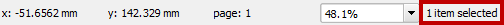
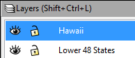
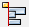

# GST 104: Cartographic Design
## Lab 3: Map Elements and Design
### Objective - Add map elements QGIS and design a layout in Inkscape to complete the colorful map of the United States of America

Document Version: 5/14/2015

**FOSS4G Lab Author:**
Richard Smith, Ph.D., GISP
Texas A&M University - Corpus Christi

**Original Lab Content Author:**
Richard Smith, Ph.D., GISP
Texas A&M University - Corpus Christi

---

The development of the original document was funded by the Department of Labor (DOL) Trade Adjustment Assistance Community College and Career Training (TAACCCT) Grant No.  TC-22525-11-60-A-48; The National Information Security, Geospatial Technologies Consortium (NISGTC) is an entity of Collin College of Texas, Bellevue College of Washington, Bunker Hill Community College of Massachusetts, Del Mar College of Texas, Moraine Valley Community College of Illinois, Rio Salado College of Arizona, and Salt Lake Community College of Utah.  This work is licensed under the Creative Commons Attribution 3.0 Unported License.  To view a copy of this license, visit http://creativecommons.org/licenses/by/3.0/ or send a letter to Creative Commons, 444 Castro Street, Suite 900, Mountain View, California, 94041, USA.

This document continues to be modified and improved by generous public contributions.

---

### 1. Introduction

In this lab, the student will learn how to add map elements to a print composer in QGIS.  Additionally, the student will use Inkscape to complete the design of a colorful map of the United States of America (USA) that was started in Lab 1.  Inkscape is a free, open source vector graphics software useful for creating maps, among other products.

*Note*: If you have not yet completed Labs 1 and 2, the Lab Data folder contains a copy of the completed data for you to use. It does not contain the data required to complete the challenge.

This lab will focus primarily on adding map elements to the print composer and exporting those elements to be used in Inkscape for final map design.  By the end of the lab, the student will have a completed color map of the USA.  
This lab includes the following tasks:

+ Task 1 – Composing and Exporting Maps
+ Task 2 – Basics of Inkscape
+ Task 3 – Importing and Arranging Maps in Inkscape
+ Task 4 – Designing the Final Map Layout
+ Task 5 - Challenge: Complete Challenge from Lab 1 (optional)

### 2 Objective: Utilize QGIS and Inkscape to Complete the Design of the Colorful Map of the United States of America

To achieve a properly designed map, the features on the map must be easily distinguishable, attractive to the map reader, and stand out from the grounds (supporting background information/data).  In this lab, the student will learn how to utilize QGIS and Inkscape to compose a well-designed map.

### Task 1 Composing and Exporting Maps

In this task, you will use the QGIS Print Composer to prepare and export the Lower 48, Alaska, and Hawaii maps that you made and refined in Labs 1 and 2.  By using Print Composer to export the maps, we can export the maps in a vector format which allows us to modify the individual features of the maps, if needed.  After we export the maps, we will import the maps in to Inkscape to compose our final map layout.

1. Open QGIS Desktop.
2. Open the Lower 48 States.qgs QGIS project file that you created in Labs 1 and 2.
3. Click Project | New Print Composer from the main file menu.
4. Enter ‘Lower 48 States’ as the Composer title.
5. Click OK.  This will set the title and open a new print composer window.

We need to take a moment to refresh our memories on the Print Composer.  The figure below identifies the components of the Print Composer.  Below are brief descriptions of the Print Composer components.

+ **Composition View**: Displays the map composition.  
+ **Information Panels**: A collection of panels that allow you to set the properties of the composition, any selected map element, and atlas generation.   
+ **Command History**: A list of commands that you have performed on the composition.
+ **Composer Items**: Commands that add , select, pan, and move map elements to the composition.
+ **Composer**: Commands that save, create, print, and export the map composition.
+ **Paper Navigation**: Tools to navigate around the virtual paper (on which you compose your map) in the Composition View.
+ **Composer Items Actions**: Commands to group, lock, order, and align selected map elements.
+ **Atlas**: Commands used to generate an atlas.  Will not be used in this lab.

We are going to use the Print Composer to create a map of the Lower 48 States and then export it for use in Inkscape later.  As we will be producing our final map on a 8.5 x 11 inch piece of paper, in landscape orientation, we will first set a few composition options, then add the map to the composition view.

6. Click ‘Composition’ tab in the Information Panels.  Set the following options:
	+ Presets: ANSI A (Letter; 8.5 x 11 in)
	+ Orientation: Landscape
7. Click ‘Add new map’ button on the Composer Items toolbar.  Drag a large box on the Composition View.  This will create a map view showing the Lower 48 States.
8. To maximize the size of the map, set the position and size to use the entire 8.5x11 inches of the paper.  To do this, do the following:
	+ Click ‘Select/Move item’ tool   and select the map.  You should have one item selected.  You can check to see how many items are selected at the bottom of the composer window (shown in figure below).
	+ Click ‘Item Properties’ tab in the Information Panels section of the Print Composer.
	+ Expand ‘Position and size’ section.
	+ Set the following properties:
		+ X: 0 mm
		+ Y: 0 mm
		+ Width:279.4 mm
		+ Height: 215.9 mm

These properties set the map’s origin to 0,0, which is the top-left corner of the page.  The width and height are set in millimeters.  279.4mm and 215.9mm are 11in. and 8.5in. respectively, which is our page size.  By setting these values, we are maximizing the size of our map on the page.

9. Now we can re-synchronize the extent with what we had set in QGIS.  Click ‘Item Properties’ tab in the Information Panels section of the Print Composer.
10. Click ‘Set to map canvas extent’.  This will set the map extent to match the extent we have set in the QGIS project.
11. Now set the scale to 18,000,000.  Still in the Item properties tab, set Scale to 18000000.
	+ If your map is still not centered, either:
		+ Change the map extent using the zoom and pan tools in QGIS
		+ Use the ‘Move item content’ tool    on the Composer Items toolbar to move the map inside the Composition View.

With the map composed how we like it, we will now prepare for it for exporting to PDF format.  PDF format is preferred for exporting vector data as the format preserves the vector data and does not rasterize it.  This allows for vector editing without loss of quality of the data.  To prepare for export, we will set the export resolution, and set the backgrounds as transparent.

12. Click ‘Composition’ tab in the Information Panels.  Set the following options:
	+ Page background: Change | Transparency: 100%
	+ Export Resolution: 300 dpi
13. Select the map, then click ‘Item properties’ tab in the Information Panels.  Set the following options:
	+ Background: unchecked
14. Click Composer | Export as PDF…
15. Save the PDF as ‘Lower 48 States.pdf’ in your lab folder.
16. Using what you have learned in this Task, export Hawaii and Alaska as PDF files using similar settings as above.  For each export, set the scale to show the states as large as possible without showing any part of the Lower 48.

### Task 2 Basics of Inkscape

This task will teach you the basics of Inkscape, an open source vector-editing program, that we will use to complete our map design.  The reason we are using Inkscape to complete the map design is because QGIS does not allow for multiple QGIS Project maps to be displayed on a single print composer (there is a work-around way to do this, but it is clunky and confusing).  Exporting maps for final composition in a graphics-editing program is a common workflow for cartographers and so we are not working outside of what would be considered a normal workflow.

1. Open Inkscape.

The figure below shows the interface, and the following text describes the sections of the Inkscape interface.

+ **Composition View**: Displays the composition.  
+ **Menu Bar**: Provides access to Inkscape’s capabilities.  Many of these capabilities are also provided in the other bars on the interface for faster access.  
+ **Tool Controls Bar**: Contains tools to select, rotate, position, scale, and arrange objects and nodes in the composition.
+ **Toolbox**: Tools that allow for selection, vertex editing, zooming, drawing, and text editing, among others.
+ **Commands Bar**: Provides quick access to open, save, print, import, export, copy/paste, and quick zoom commands.
+ **Snap Controls Bar**: Provides quick access to a variety of snapping controls.  Will not be used in this lab.
+ **Palette**: Quick access to colors.  Click to set a fill color, shift-click to set a stroke (line) color.
+ **Status Bar**: Displays location of mouse cursor, selected colors, active layer, and layer visibility and locked status.

Any of the above bars may be shown or hidden by clicking View | Show/Hide.

Inkscape is quite powerful and has hundreds of commands at its disposal.  For this lab, you will only use a small subset of commands to design your map layout.  You are encouraged to further explore Inkscape’s capabilities as many may be useful for future map designs.  The following is a list of commands that you will rely on heavily when designing your map.

+ Select and transform objects tool 
 (toolbox) – This tool allows you to select objects in the composition.  Once an object is selected, its handles will appear, and you can select those to scale and transform the objects.

+ Zoom in or out tool  (toolbox) – Left-click or drag a box to zoom in.  Right-click to zoom out.

+ Create rectangles or squares  (toolbox) – Click and drag to create a rectangle.  Hold down the Control key on your keyboard to create a square or integer-ratio rectangle. You can set the fill and stroke color to different colors.

+ Click Draw Bezier curves and straight lines   (toolbox) – Click and drag, then drag and click to create a Bezier curve.  Click, move, then click again to create a straight line segment.  Double-click to complete the line or curve.  Hold down the Control key on your keyboard to have the line rotate in 15° increments.

+ Create circles, ellipses, and arcs   (toolbox) – Click and drag to create a circle.  Hold down the Control key on your keyboard to create a square or integer-ratio ellipse.  You can set the fill and stroke colors to different colors.

+ Create and edit text objects  (toolbox) – Click to start a text object then type in the desired text.

+ Import a bitmap or SVG image…  (commands bar) – This command will open the import dialog for you to select a file to import in to the inkscape document.

+ Group selected objects  (commands bar) – With objects selected in the composition view, this command will group the objects together.  They objects will then be considered a single object and will move, scale, and transform together.  Grouped items can be ungrouped with the ‘Ungroup selected objects’ command.

+ Ungroup selected objects  (commands bar) – With objects selected in the composition view, this command will ungroup the objects.  Ungrouped objects are able to be manipulated separate from other objects.

+ Edit objects’ color, gradients, stroke width…  (commands bar) – This command opens the Fill and Stroke panel. The panel allows a selected object’s properties to be modified.  Commonly changed object properties are the fill color, stroke color, stroke style, and object opacity.

+ View and select font family…  (commands bar) – This command opens the Text and Font dialog.  This dialog allows you to set the font family, style, size, layout, and text of a selected text object.

+ View Layers  (commands bar) – This command opens the Layers panel.  This panel displays all layers in the composition and allows you to set the layer name, visibility, opacity, and lock status.  Additionally, you can add and remove layers, and set the draw order.

+ Align and distribute objects   (commands bar) – This command opens the Align and Distribute panel.  This panel has numerous commands that will set the alignment and distribution of selected objects.

In general, an Inkscape document contains multiple layers of objects.  Each object has multiple properties, such as color, stroke thickness, opacity, and position.  Multiple objects can be grouped for control of multiple objects simultaneously, or, ungrouped for finer, individual object control.  Objects can be ungrouped to the component level.  For instance, a square can be ungrouped so that the stroke (outline) is a single object, and the fill is a single, separate object.  Grouping/ungrouping and layering objects allows for powerful, and fine grained, control over the Inkscape document and objects within.

Now that you have a brief overview of Inkscape’s layout, we can get to work designing our map.

### Task 3 Importing and Arranging Maps in Inkscape

We will design a colorful map of the USA in Inkscape that will be composed on an 11 inch x 8.5 inch piece of paper in landscape orientation.  To prepare for the design, we will first set a few document properties, and then import the three maps we exported in Task 1; each map will be imported to a separate layer.

1. In Inkscape, click File | Document Properties…
2. Click the ‘Page’ tab and set the following properties:
	+ Background color (click background color box): R: 255; G 255; B: 255; A: 0
		+ This sets the background to fully transparent.
	+ Page Size: US Letter  8.5 x 11.0 in
	+ Orientation: Landscape
	+ Show border shadow: unchecked
		+ Removing the page border shadow reduces confusion as to where the actual page border is located.
3. Close the Document Properties.

Now we can import our PDF maps.

4. Click File | Import… or the Import button on the commands bar  .  This will open the Import dialog.
5. Choose ‘Lower 48 States.pdf’ from your lab directory.  Click Open.  This will open the PDF Import Settings dialog.
6. Click OK to import the PDF as a new layer in the Inscape document.
7. You should now have your Lower 48 map displayed in Inkscape.  Take a moment to use the Select tool  to center the map on the page. 
	+ Also note that every state is labeled!  This is great news as it saves us time from having to manually create the labels that appeared to be missing in QGIS.  The on-screen rendering in QGIS may differ from the exports, so always double-check.  In this case, it worked in our favor.

8. Click View layers   button to open the Layer panel. Alternatively, you can click Layer | Layers from the menu bar to open the Layer panel. Note that there is a single layer listed, ‘Layer 1’ (shown in figure below).

9. Click the visibility toggle  .  The map will disappear.
10. Click the visibility toggle  .  The map will re-appear.  Turning layers’ visibility on and off help de-clutter the document and makes it easier to focus on certain elements.
11. Double-click ‘Layer 1’ text to make it editable.  Rename the layer ‘Lower 48 States’ then press Enter on your keyboard.  The layer is now distinctly named which will make it easier to reference it later.
12. Click the lock toggle  .  This will lock the layer and prevent you from selecting or modifying the layer.  Try selecting the layer with the select tool.  You cannot.  This is very handy when you wish to prevent a layer from being accidentally modified.
13. Click the lock toggle  .  This will unlock the layer and allow selection and modification.

With the Lower 48 imported, we will now import Hawaii and Alaska in to Inkscape.  Each map will be imported in to a separate layer so we can manipulate them separately.  
14. In the Layers panel, click Create a new layer  .  This will open the Add Layer dialog.  
15. Set the Layer name to ‘Hawaii’ and the Position to ‘Above current’.  
16. Click Add to add the new layer.  
17. Select the Hawaii layer in the Layers panel.  A selected layer will have a blue background and will also be displayed in the status bar at the bottom of the Inkscape program.  See the figure below for reference.  The selected layer will be the target layer for imported files, and for other reasons we are not concerned about right now.

(a) 

(b) 

18. Click File | Import… or the Import button on the commands bar  .  This will open the Import dialog.  
19. Choose ‘Hawaii.pdf’ from your lab directory.  Click Open.  This will open the PDF Import Settings dialog.
20. Click OK to import the PDF as a new layer in the Inscape document.  You will see Hawaii displayed on the Inkscape document.
	+ If the Lower 48 is obscured by a white background box in the Hawaii layer, remove the Hawaii layer, and re-visit steps in Task 1 to re-export the Hawaii layer with a transparent background.
21. Hold down the Control key on your keyboard.  Use the Select tool    and grab the scale arrows of a corner of the Hawaii layer (See figure below) and drag scale Hawaii down to a smaller size. By holding down the Control key, it maintains the aspect ratio of what you are scaling.  This means that Hawaii will maintain its correct shape when being scaled.

22. Use the Select tool   to move Hawaii to the lower left-hand corner of the map.  The placement of Hawaii should be below Texas and roughly placed in the same location shown in the figure below.

23. Repeat steps in this Task to import Alaska to its own layer and place it left of Hawaii.  Your document should now look similar to the figure below.

24. Take a moment to save your work in your lab directory.  Click File | Save and name your document ‘Colorful Map of the USA’ in the ‘Inscape SVG (*.svg) format.
25. Click Save to save the document.

### Task 4 Designing the Final Map Layout

In this task, you will complete the map design by adding a title, metadata, neatlines, adjusting line thicknesses for Alaska and Hawaii, and adjusting labels sizes and placement.

First, adjust the line thickness for Alaska and Hawaii.

1. In Inkscape, select the Alaska layer so that it is the current layer.
2. Use the Select tool and select Alaska in the Composition View.
3. In the Command Bar, click Edit object’s colors… button   to open the Fill and Stroke Panel. Alternatively, click Object | Fill and Stroke from the menu bar.
4. Click the Stroke style tab in the Fill and Stroke Panel.
5. Set the Width to 1.417 which is the same width as the state boundary lines in the Lower 48.  
	+ I found the width of a state boundary by clicking the Edit paths by nodes button  on the Toolbox then selecting a state.  I then inspected the width in the Fill and Stroke Panel under the Stroke style tab. 
6. Repeat the steps to set the line width to 1.417 for Hawaii.

Next, we can change the placement of labels for Florida, Louisiana, Connecticut, Rhode Island, New Hampshire, Vermont so that they are more centrally placed and/or easier to read.  To accomplish this, we will need to ungroup the Lower 48 so we can manipulate the individual label objects.

7. Use the Select tool and select the Lower48 in the Composition View.
8. In the Commands Bar, click Ungroup selected objects button   .  This will separate the object in to multiple smaller objects.  When this happens, you will see selection boxes appear around the labels and label ovals (shown in figure below).  If you do not see the selection boxes around the labels, keep clicking the Ungroup selected objects button.

9. Press the Escape key on your keyboard to de-select everything.  If you tried to select a label with everything selected, it would not allow you to select it.  Instead, after you ungroup, you will need to de-select everything, then select the ungrouped object of interest.
10. Click the Zoom in or out tool  in the toolbox, then zoom in close to the north-eastern states.  Some of the labels are overlapping or too close to each other so we will separate them for readability.
11. Hold down the Shift key on your keyboard and use the Select tool to select the ‘VT’ label and the associated white ellipse. You may need to click a few times to get this to work.  You can also drag a box around the label and ellipse, but make sure you do not select other labels or states.  You will know you are successful when you see two selection boxes; one around VT and one around the ellipse (as shown in the figure below).

12. Press the Group selected objects button  on the commands bar to group the label and its background ellipse together.  This will make the label easier to select in the future, if needed.
13. Move the VT label slightly up (North) so it does not crowd the NH label as much.
14. Select the NH label and ellipse, group it, and move it slightly down (South) so it does not crowd the VT label as much.
15. Move the MA, RI, CT, MD, DE labels to more reasonable locations.  The figure below shows a reasonable arrangement.  
	+ Here is an optional neat trick that may or may not be useful.  If you select multiple labels that overlap, you can use the ‘Move objects as little as possible so that their bounding boxes do not overlap’ button   (whew! long button name!) in the Align and Distribute Panel.  This will do exactly what the button says it will do and may produce a desirable result.

16. Click Zoom to fit page in window button  on the commands bar to zoom to the entire map.  The ‘5’ key on your keyboard is a shortcut for this command.
17. Move the LA and FL labels to locations that are more reasonable.  You may need to zoom in to select more accurately.  Feel free to move any other labels that you feel should be moved.

Now we can turn our attention to the labels for Alaska and Hawaii.  They are quite small!  They are that small because they were scaled down when we scaled down the imported PDF in Task 3.  We will change these labels to the appropriate size again.  I will show you two methods to accomplish this task.

18. Zoom in close to Alaska.  Select then ungroup Alaska multiple times until you see the selection boxes around the label and ellipse.
19. Select the AK label and ellipse and press the Delete key on your keyboard.  This will delete the label and ellipse.  Alternatively, you could have right-clicked on the selected objects and then chosen Delete from the contextual menu.
20. Click Zoom to fit page in window button.
21. Zoom to Louisiana (LA).
22. Select the LA label and ellipse.
23. Click the Duplicate selected objects button  on the commands bar.  This will create a duplicate copy of the label and ellipse and place it on top of the existing label.
24. With the label still selected, zoom to the entire page, then move the duplicated label over Alaska.  Oh no!  The label disappeared behind Alaska!  The reason this happened is because the duplicated object is still on the Lower 48 layer, which is placed below the Alaska layer (reference the Layers Panel for draw order).  We will need to move the duplicated label up to the Alaska layer so it will display correctly.
25. With the label selected, hold Shift key and press Page Up key two times. Notice that every time you press Page Up, the active layer in the Status bar changes to the layer that the object is now placed in.  On the fifth press, you should reach Alaska as the active layer.  If you go too far, hold Shift key and press Page Down key.  You can also move the layers above and below using the Layer menu in the Menu bar.  
	+ If you unselected the label and it is hidden behind Alaska, turn off the Alaska layer visibility in the Layers panel, move the label to the Alaska layer (it should disappear when this happens), then turn the Alaska layer back on.
26. Zoom in close to the label on Alaska.  Unfortunately the ‘LA’ label is not actually editable text.  It is consider a path object (drawn lines having no textual meaning).  Therefore, we will need to create a new text object, and make it the same size as the ‘LA’ symbol, then change it to ‘AK’.
27. With Alaska still the active layer, click Create and edit text objects tool   on the toolbox, then click above the LA label.  This will create a new text object.
28. Type LA.  LA will appear on the composition.  
29. Use the Select tool to select the newly created text. 
30. Click Text | Text and Font on the menu bar to open the Text and Font dialog.  
31. Select Arial for the font family.  Arial is the font we used to label the states in QGIS (I went back and checked, you can too!), so we are matching the font in Inkscape.
32. Click Apply then Close to set the font to Arial.
33. Ungroup the LA label from the ellipse.
34. Select both the LA label and the LA text you created using the text tool.
35. Open the Align and Distribute panel by clicking the Align and distribute objects button    on the commands bar.
36. Set the following options and click the following buttons on the Align and Distribute Panel:
	+ Relative to: Last Selected
	+ Click Align bottom edges button 
	+ Click Align left edges button 
37. With the origins of the labels together (shown in the figure below), you will now resize the text label (the larger one) to make it the same size as the path label (smaller one). Press escape key on your keyboard de-select everything.

 

38. Select the LA text (larger one), hold down the Control key on your keyboard, and use the top-right resize arrows to make the larger text the same size as the smaller text.  Holding down the Control key maintains the aspect ratio of the resizing object.
39. Re-open the Text and Font dialog (Text | Text and Font) and notice that the Font size is right around 18. Now we know which font size we are working with.
40. Set the Font size to 18.  
41. Click the Text tab and then change the text to AK.
42. Click Apply then Close to close the Text and Font dialog.
43. Move the new text label off of the ellipse.
44. Select and delete the paths label on the ellipse.  Now we will put the next text label exactly in the center of the ellipse.
45. Select both the text label and ellipse.
46. Open the Align and Distribute panel by clicking the Align and distribute objects button    on the commands bar.
47. Set the following options and click the following buttons on the Align and Distribute Panel (reference figure below):
	+ Relative to: Last selected
	+ Click Center on vertical axis button    
	+ Click Center on horizontal axis button  

48. Notice that the ends of the A and K are touching the edges of the ellipse.  We need to give the label more breathing room, so let’s make the ellipse slightly larger.  Select the ellipse.  Hold down the shift key and drag a resize handle to make the ellipse slightly larger.  Using the select key resizes the object about its centroid.  See the figure below for reference.

49. Select both the text and ellipse and group them.
50. Move the newly created label to a reasonable location on Alaska.

Whew!  Quite a few steps to change something so small!  The reason I pulled you through all of those steps is so you can get some practice with selections, grouping, layers, aligning, and resizing.  These simple commands are quite commonly used and powerful when designing a map.

Now we can try a second method to resize Hawaii’s label that is much quicker, but may not produce completely accurate results.

51. Zoom in close to Hawaii.  Select then ungroup Hawaii multiple times until you see the selection boxes around the label and ellipse.
52. Select and group the HI label and ellipse.
53. Zoom to the IN (Indiana) label and select the label and ellipse.
54. Click Edit | Copy from the menu bar.
55. Zoom back to the HI label and select it.
56. Click Edit | Paste Size | Paste Size from the menu bar.  Violà!  The Hawaii label is now the same size as the Indiana label.  Let’s discuss the downsides to doing this for a moment.  First, we chose IN label because it was roughly the same shape and character width as HI, therefore, when it is scaled, the font size should be very close and the label should not be stretched unusually.  Had we chosen CA, for instance, you would notice the stretching of the HI label.  The previous (long) method is a safer choice, however, this method will work in a pinch, but please check for consistency between like items (labels in this case) when you use this method.
57.	Move the HI label to a reasonable location on Hawaii.  Your map should look similar to the figure below at this point.

Now we will add a neatline around the entire map, and neatlines around Alaska and Hawaii.

58. Create a new layer, name it ‘Neatlines’, and place it at the top of the list of layers. If the layer needs to be moved up or down, select the target layer, then use the raise or lower buttons in the Layers Panel (see figure below).

59. With the Neatlines layer set as the active layer, select the Create rectangles and squares tool   on the toolbox, and click and drag a box around the entire map, and just inside the page border.  A solid box will cover your entire map.  Let’s change the fill and line properties.
60. With the box still selected, click Edit objects’ color, gradients, stroke width…   button on the commands bar.  This will open the Fill and Stroke panel.
61. On the Fill tab, click No paint button  . (Reference figure below).

62. On the Stroke paint tab set the RGB values to 0, and Alpha to 255.  This will make a black stroke that is fully opaque.
63. On the Stroke style tab, set the Width to 0.75 mm.  This makes for a reasonably thick neatline.
64. Now we will align the neatline to the center of the page.  Open the Align and Distribute panel and set the following:  
	+ Relative to: Page  
	+ Click Center on vertical axis button .
	+ Click Center on horizontal axis button .
65. Resize your neatline to include all maps if the alignment made it overlap. Re-align as necessary.  Your map should look similar to the figure below.

We will next add a neatline around Alaska and Hawaii.  We can start with Alaska.

66. With the Neatlines layer set as the active layer, select the Create rectangles and squares tool  on the toolbox, and click and drag a box around Alaska giving the state a little breathing room. Now we can change the fill and line properties.
67. With the box still selected, click Edit objects’ color, gradients, stroke width…   button on the commands bar.  This will open the Fill and Stroke panel.
68. Set the following Fill and Stroke options:  
	+ Fill tab  
	+ No fill    
	+ Stroke paint tab  
		+ RGB: 0  
		+ Alpha: 255  
	+ Stroke style tab  
		+ Width: 0.5 mm  
			+ To give the appearance of a heiarchy in the map, we are making the interior neatlines .25mm thinner than the map’s neatline.  
69. Select the Alaska neatline *then select* the map neatline.
70. Open the Align and Distribute panel and do the following:
	+ Relative to: Last selected
	+ Click Align bottom edges button  
	+ Click Align left edges button  
71. Move the Alaska state and label if it no longer is inside the neatline, or, make the neatline larger.  It may be useful to re-group the Alaska state and label so you can move it as one unit.  Your Alaska neatline should look similar to the figure below.

Now we will create a neatline around Hawaii.  However, we won’t create a boring square neatline, we will create a neatline that follows Hawaii’s shape and, therefore, won’t crowd Texas on the map.

72. Click Draw Bezier curves and straight lines tool  in the toolbox.
73. Click once to the right of Hawaii and on the map neatline.
74. Hold down Control key on your keyboard and move your mouse.  Notice that the line rotates in 15° increments.  This allows for nice, straight and diagonal line drawing.
75. Using the control key and mouse clicks, draw the neatline shown in the figure below. Double-click to complete the line drawing.

You can see which angle you are snapping to in the Status bar (see figure below).  Make sure to connect the end of the neatline to the Alaska neatline.  Don’t worry about connecting exactly, we will address that in the next steps.

76. Using the Fill and Stroke panel, set the Hawaii neatline’s properties to match Alaska’s neatline properties. Reference step 68 above for a reminder.
77. Use the Align and Distribute panel to align Hawaii and the map’s neatline to each other’s bottom edges.
78. Zoom in close to where Alaska and Hawaii’s neatlines touch.
79. Move the Hawaii neatline left or right to have it intersect with Alaska’s neatline.
	+ Alternatively, you can select the Hawaii neatline first then select the Alaska neatline, then, in the Align and Distribute panel, click Align left edges of objects to the right edge of the anchor button .
80. Open the Layers panel and lock the Neatlines layer.  This will prevent us from accidentally selecting the neatlines as we place the title and metadata.

Now we will add the title and metadata.

81. Create a new layer named ‘Title and Metadata’ and place it at the top of the Layers list.  
82. Make sure ‘Title and Metadata’ is the active layer, then click Create and edit text objects button  in the toolbox.  
83. Click above the Lower 48 and enter the following title: ‘United States of America’.
84. Select the title text then click Text | Text and Font from the menu bar.  This will open the Text and Font dialog.
85. Set the following Text and Font properties:
	+ Font family: Arial
	+ Font size: 32

The title should be centered on the page, so, instead of trying to figure out where center is ourselves, we will use the Align and Distribute Panel to do it for us.  

86. Select the title, then click the Align and distribute objects button  in the commands bar.  This will open the Align and Distribute Panel.
	+ Set the following options (shown in figure below):
		+ Relative to: Page
		+ Click Center on Vertical Axis button 

87. Use the Select tool to center the title halfway between the top of the Lower 48 and the neatline.
88. Make sure ‘Title and Metadata’ is the active layer, then click Create and edit text objects button  in the toolbox.  
89. Click in the lower right-hand corner of the map and enter the following metadata then press Enter on your keyboard.
	+ Map Author: <your name>
Made with Natural Earth.  Free data at naturalearthdata.com.
		+ It is not necessary to cite Natural Earth, however, I feel it is important to give credit for their amazing product.  For more information, read their Terms of Use.
90. Select the metadata text then click Text | Text and Font from the menu bar.  This will open the Text and Font dialog.
91. Set the following Text and Font properties:
	+ Font family: Arial
	+ Font size: 10
	+ Layout: Center lines 
92. Click Apply then Close to apply the text and font properties.
93. Move the metadata so it is in the lower-right hand corner of the map.
94. Save the Inkscape document.

That is it!  We are done designing the map!  Your map should now look like the figure below.  

The last thing we need to do is export this map.

95. Click File | Save a Copy… from the menu bar.
96. Save the map as a Portable Document Format (*.pdf) in your lab directory.  Name the map whatever you want, you made it, after all!  Click Save.  Another dialog will open.
97. Accept the defaults for the Portable Document Format dialog.  Click OK to save the PDF.

### Task 5 Challenge: Complete Challenge from Lab 1 (optional)

Complete the challenge from Lab 1.  Compose a final map design in Inkscape.

Lab 1 Challenge:

Now that you have designed a map at a national level, your next challenge is to choose a state that contains multiple smaller administrative units (e.g. county, parish) and make a colorful map of that state.  In the map, choose a pleasing color scheme, and label all counties and the state.  Additionally, make the state outline thicker than the county outlines; this may require some creating thinking on your part.
To accomplish this challenge, the 2013 TIGER County boundaries have been placed in the lab 1 directory.  The county shapefile is named ‘US Counties 2013 – TIGER.shp’.

### 3 Conclusion

In this lab, you have learned how to use Inkscape to import PDFs, modify objects on those PDFs, create new layers, draw new objects, add text, and export the composition.  While this lab was long and, at times, tedious, the design skills and concepts are very common when designing maps and do transfer over to other software packages.  Going forward in the lab series in this course (and hopefully in your professional career), you will continue to utilize Inkscape to design two more maps beyond what QGIS could do alone.

### 4 Discussion Questions

1. Submit your exported colorful map of the USA for grading.
2. In Inkscape, click File | Document Properties | Snap tab.  Set the Snap to objects Snap distance to 50 then close the Document Properties.  Zoom in close to a neatline.  Click the Draw Bezier curves and straight lines tool.  Click just outstide the neatline.  Notice that the path snapped to the center of the path!  Now, explore the Snap Controls bar and discuss what snapping is, and identify two places in this lab where snapping would have come in useful.
3. We can add a little more pizazz to our map. Inkscape has a huge library of Filters that can do interesting things to our map.  Your challenge is to apply a drop shadow to the map using the filter located at: Filters | Shadows and Glows | Drop Shadow…  Add a drop shadow the the Lower 48, Alaska, and Hawaii.  It may be useful to group everything on each of the three layers first, then apply the drop shadow to the selected group.  To easily select everything in a layer, lock all other layers, then drag a large selection box around the objects to select. Export a PDF and submit the map with a  drop shadow for grading.  Your map may look similar to the one below.

