# GST 104: Cartographic Design
## Lab 4: IDP and Refugee Proportional Symbol Map
### Objective - Design and construct a proportional symbol map in QGIS, then export the maps for layout in Inkscape

Document Version: 5/5/2015

**FOSS4G Lab Author:**
Richard Smith, Ph.D., GISP
Texas A&M University - Corpus Christi

**Original Lab Content Author:**
Richard Smith, Ph.D., GISP
Texas A&M University - Corpus Christi

---

The development of the original document was funded by the Department of Labor (DOL) Trade Adjustment Assistance Community College and Career Training (TAACCCT) Grant No.  TC-22525-11-60-A-48; The National Information Security, Geospatial Technologies Consortium (NISGTC) is an entity of Collin College of Texas, Bellevue College of Washington, Bunker Hill Community College of Massachusetts, Del Mar College of Texas, Moraine Valley Community College of Illinois, Rio Salado College of Arizona, and Salt Lake Community College of Utah.  This work is licensed under the Creative Commons Attribution 3.0 Unported License.  To view a copy of this license, visit http://creativecommons.org/licenses/by/3.0/ or send a letter to Creative Commons, 444 Castro Street, Suite 900, Mountain View, California, 94041, USA.

This document continues to be modified and improved by generous public contributions.

---

### 1. Introduction

In this lab, the student will learn how to design a proportional symbol map in QGIS. This map will show Syrian Internally Displaced Persons (IDPs) and Refugees.  The figure below shows an example final product that will be completed by lab 5.

This lab will focus primarily on setting colors, line thicknesses, layer drawing order, and proportional symbols.  The secondary focus is exporting the map document and preparing a rough design in Inkscape.

The map designed in this lab will be completed in lab 5.  Additionally, the layout designed for this map may be partially re-used for a related choropleth map designed later in Lab 6.

It is assumed that the student has completed labs 1,2, and 3 and has a working knowledge of Inkscape and QGIS.  Because of this assumption, the student will be asked to complete tasks that were covered in the previous labs without being provided step-by-step instructions.  Tasks that have not been covered in previous labs will be covered in detail in this lab.

Acknowledgement: The author would like to thank Mr. Olivert Garcia for allowing his Syria IDP and Refugee map design to be used as a teaching tool.

This lab includes the following tasks:

+ Task 1 – Rough Design of the Final Map
+ Task 2 – Design a Proportional Symbol Map in QGIS
+ Task 3 – Export Map by Layers
+ Task 4 – Prepare Rough Map Design in Inkscape
+ Challenge: Create Layout in QGIS

### 2 Objective: Utilize QGIS and Inkscape to Complete the Design of a Proportional Symbol Map Showing Syrian IDPs and Refugees

To achieve a properly designed map, the features on the map must be easily distinguishable, attractive to the map reader, and stand out from the grounds (supporting background information/data).  In this lab, the student will learn how to utilize QGIS and Inkscape to compose a well-designed proportional symbol map.

### Task 1 Rough Design of the Final Map

It is often useful to think of a rough design for your final map product at the beginning.  This is especially useful if your map will have multiple components, such as text, pictures, graphs, and so on.  Map design is an iterative process.  Though carefully planned designs at the beginning may not be what the final map ends up resembling, it is still worth going through the exercise of thinking through the parts of your map.

Now, normally this iterative map design process is organic and you will often need to experiment with designs for a while until the map begins to become well-designed.  However, you are at a disadvantage for these labs because as the lab author, I have already designed the map I am going to teach you how to make (shown in figure above).  That does not mean that you cannot make changes to improve upon the design, but, in order for you to follow the instructions, you’ll need to at least first make the map as I describe, then you can tweak and make it your own, if you choose.

So with that caveat in mind, let’s start with discussing the rough map design.  First, let’s consider the final map design, but focus on segmenting the page up for sets of items.  The segmented final map is shown in the figure below.  The blue lines are guidelines created in Inkscape by clicking and dragging from the ruler on to the map.  Making guidelines are a useful tool for making sure that items line up.

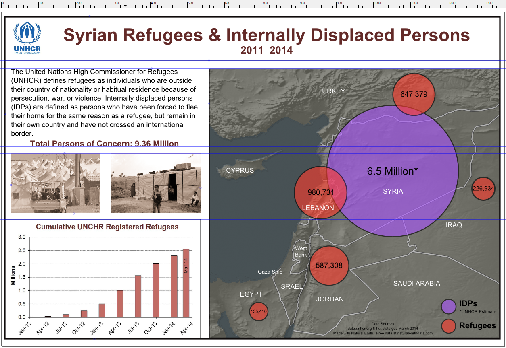

If we generalize our map design to a rough idea of where things will go, we can create a sketch that looks like the figure below.  Note that the measurements are nice round numbers, however, the final product does not need to follow those measurements that exactly as often times things may need to be transformed slightly so the map looks ‘right’.

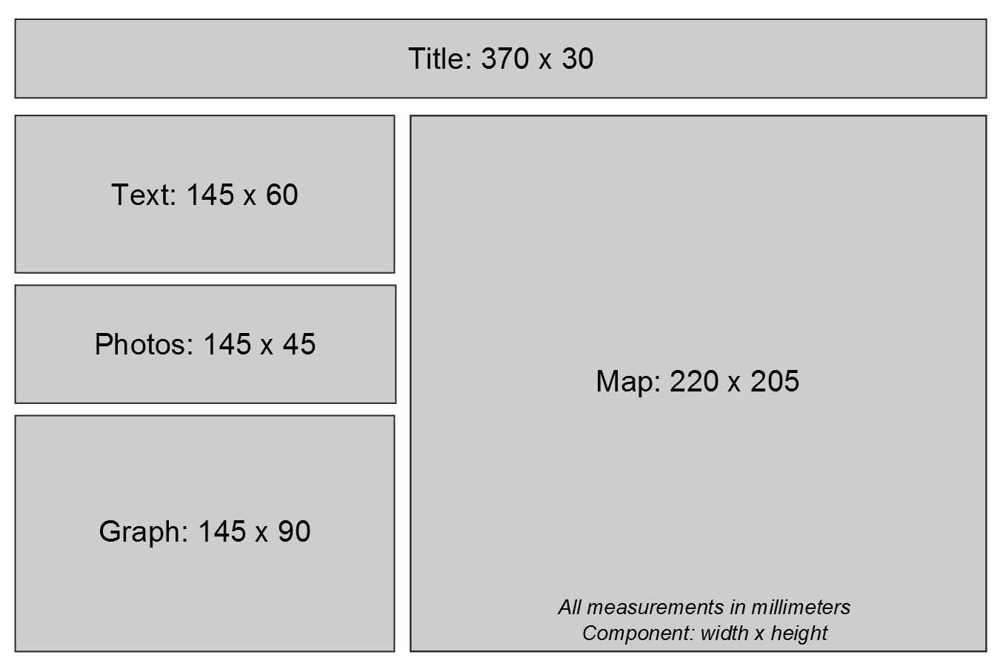

Out of the entire rough map design, what we need to set in stone now is the size of the map body.  The reason we need to set this is that when we compose the map in QGIS Composer, it is best if we export the map in the exact dimensions that will be used in the final map design.  By exporting in the exact dimensions, we can avoid having to scale the map, which may introduce artifacts.  So, for this lab, the map will be designed on a canvas of size 220mm wide by 205mm high.

With the map layout roughly designed, we can now move towards creating the proportional symbol map in QGIS.  We will re-visit this map design in Task 4 when we put this map design in to action in Inkscape.

### Task 2 Design a Proportional Symbol Map in QGIS

In this task, you will design a proportional symbol map showing Syrian IDPs and refugees.  You will design the base map and proportional symbols in this Task.  Normally you would also create the labels, however, as there are so few labels, we will do this manually in the next lab when we start finalizing the map design.

1. Open QGIS Desktop.
3. In QGIS Desktop, add the raster layer ‘GRAY_HR_SR.tif’ to the project by clicking Layer | Add Layer | Add Raster Layer from the menu bar. This is a shaded relief of the world’s land.  This will serve as a base layer for our base map to provide a little terrain detail to the map.
4. Rename the raster layer ‘Shaded Relief’. (Layer Properties | General | Layer name).  
5. Add the vector layer ‘ne_10m_ocean.shp’ to the project.  
6. Rename the newly added vector file ‘Ocean’ in the Layers panel.
7. Drag the Ocean layer above the Shaded Relief Layer in the Layers panel.
8. Set the following Style properties for the Ocean layer:
	+ Symbol layer: Simple fill
		+ Simple Fill Color:
			+ Hue: 195
			+ Sat: 15%
			+ Val: 40%
	+ Border style: No pen
9. Add the vector layer ‘ne_10m_coastline.shp’ to the project.  This layer will serve as the water boundary for the countries.  It will, essentially, mask the color of the boundaries of the country layer we will add later.
10. Rename the newly added vector file ‘Coastlines’ in the Layers panel.
11. Drag the Coastlines layer below the Ocean layer.
12. Set the following Style properties for the Coastlines layer:
	+ Symbol layers: Simple line
		+ Color: 
			+ Hue: 195
			+ Sat: 15%
			+ Val: 40%
	+ Pen width: 1.25
13. Add the vector layer ‘Countries with IDP and Refugee Information.shp’ to the project.  This layer will do triple-duty.  It will serve as the basemap, the data for the refugee proportional symbols, and the data for the IDP proportional symbol.  We will duplicate this layer twice so that we can have one layer for each duty mentioned.
14. Right-click the newly added vector file, then click Duplicate.  Do this a second time so that you now have three copies of the vector file in the Layers panel.
15. Drag the duplicated layer with its visibility turned on beneath the Ocean layer.  Rename this layer ‘Basemap’.
16. Rename another duplicated layer ‘Refugees’ and drag it to the top of the Layer list.
17. Rename the remaining duplicated layer ‘IDPs’ and drag it directly under the Refugees layer.  Your layer list should look like the figure below.  Keep the Refugees and IDPs layers’ visibility off.

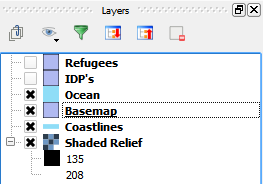

Now that we have all of our data loaded, let’s work on setting the Basemap layer’s properties so we can complete our basemap.

18. First, we want the hillshade to show on the map.  Open the Layer Properties for the Basemap layer.
19. Click the Style tab.
20. Set the Layer transparency to ‘20’.  
21. Click Apply.  You should see the hillshade become visible through the Basemap layer.  
22. Set the following Style properties for the Basemap layer:
	+ Symbol layers: Simple fill
		+ Colors: 
			+ Fill:
				+ Hue: 60
				+ Sat: 10%
				+ Val: 40%
			+ Border:
				+ Hue: 0
				+ Sat: 0
				+ Val: 25
		+ Border width: 1.25
23. To make the country borders seem not so plain, we will add a thin light-grey fill stroke down the center of black border.  This will help give the borders a little more definition.
24. Still in the Style properties for the Basemap layer, click ‘Add symbol layer’ button 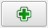 to add a new simple fill layer to the symbol.
	+ If the new Simple fill layer is not at the top, select it and press the ‘Move up’ button 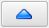.
25. Select the newly added Simple fill.  Set the following style properties:
	+ Colors: 
		+ Fill style: No Brush
		+ Border:
			+ Hue: 0
			+ Sat: 0
			+ Val: 75
	+ Border width: 0.75
26. It’s time we zoom in to Syria so we can examine our work in detail.  Zoom in to Syria and leave enough room to see part of the surrounding countries.  Use the figure below as a rough guide.

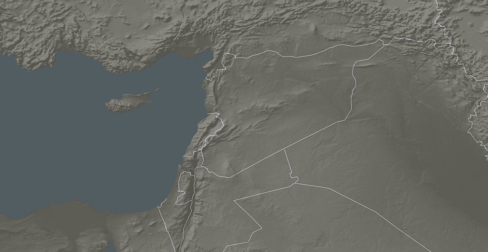

With the basemap now designed, let’s turn our attention to creating the proportional symbols that represent the refugees and IDPs.  Let’s start with the refugee proportional symbols.

27. Turn on the Refugee layer visibility.  Your map will be temporarily ruined with an ugly default fill color.  As we are only interested in having this layer display the proportional symbols, we will turn off the fill and border.
28. Set the following Style properties for the Refugee layer:
	+ Symbol layer: Simple fill
		+ Fill Style: No Brush
		+ Border style: No pen
29. Click Apply to set the Style properties.  The map is now back to its previous state.  Now let’s create the proportional symbols.
30. In the Refugee Layer Properties, click Diagrams tab.  
31. Check ‘Display diagrams’ checkbox.
32. Choose ‘Pie chart’ for the Diagram type.  The plan is to create a pie chart with a single filling (Refugees) and have it scale proportional to the value of the Refugee field in the shapefile.
33. Click Appearance tab.
34. Set Line width to 0.75.
35. In the Available attributes list, select “Refugees” (bottom of list) then press the plus sign button .  This will add the “Refugees” attribute to the Assigned attributes list.
36. Double-click on the color bar next to the “Refugees” attribute in the Assigned attributes box.  This will open the Select Color dialog.
37. Set the following color for the pie chart:
	+ Hue: 4
	+ Sat: 80
	+ Val: 100
The Diagram properties should look like the figure below.

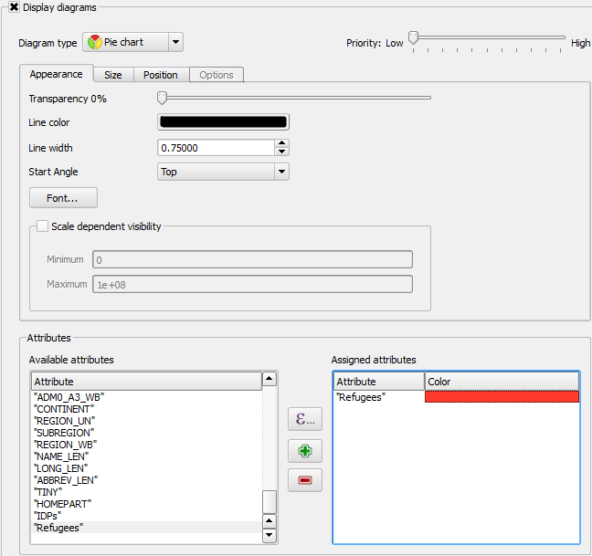

38. Click the Size tab.
39. Uncheck ‘Fixed size’.  As we want each proportional symbol to scale in relation to the refugee attribute, we uncheck this option and will now set the properties for symbol scaling.
In the Attribute dropdown box, choose ‘Refugees’.  Reference figure below for steps the next three steps.  
40. Click ‘Find maximum value’ button.
41. Set Size to 40.

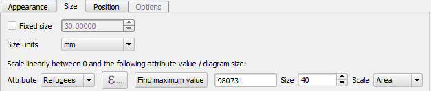

42. Click OK to complete the designing of the refugee proportional symbols. Your map should look similar to the figure below.  Note that there may be two symbols for Egypt and Turkey’s symbol may be off the page (may vary slightly depending on your map extent and scale).

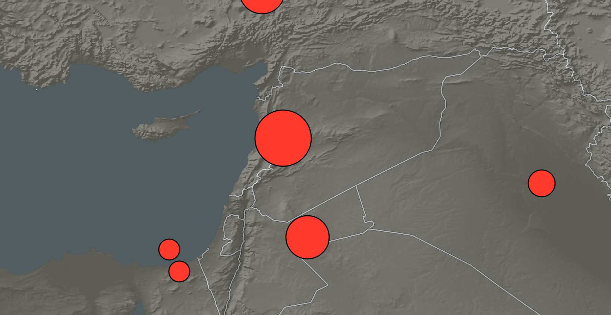

Now we can turn to creating the Syria proportional symbol.  We really want to make an impact with the size of Syria’s IDP proportional symbol, so we will have it dominate the map and be in a different color than the refugee symbols since we are talking about a different classification.

43. Turn on the IDPs layer visibility.  Your map will be temporarily ruined with an ugly default fill color.  As we are only interested in having this layer display the proportional symbol, we will turn off the fill and border.
44. Set the following Style properties for the IDPs layer:
	+ Symbol layer: Simple fill
		+ Fill Style: No Brush
		+ Border style: No pen
45. In the IDP Layer Properties, click Diagrams tab.  
46. Check ‘Display diagrams’ checkbox.
47. Choose ‘Pie chart’ for the Diagram type.
48. Click Appearance tab.
49. Set Line width to 0.75.
50. In the Available attributes list, select “IDPs” (bottom of list) then press the plus sign button .
51. Double-click on the color bar next to the “IDPs” attribute in the Assigned attributes box.  This will open the Select Color dialog.
52. Set the following color for the pie chart:
	+ Hue: 270
	+ Sat: 70
	+ Val: 100
53. Click the Size tab.
54. Unheck ‘Fixed size’.  If we kept Fixed size checked, even countries with NULL IDP attributes will have a circle displayed.  Since we want to avoid that, we will still scale the size of the proportional symbols to the attribute value.
55. In the Attribute dropdown box, choose ‘IDPs’.
56. Click ‘Find maximum value’ button. Notice that the maximum value is 6,500,000.  Roughly 6.5 times the amount of the country with the larger number of refugees (Lebanon – 980,731).  If we set the size to be 6.5 times larger than the size of the largest refugee symbol (40mm), it would be a staggering 260mm!  That would completely cover the map!  (If you are curious, try 260 and see for yourself.  I’ll wait.)
So, our options are to a) make the refugee circles smaller, or b) use some ‘cartographic license’ to scale down the IDP circle.  If we choose option a, the refugee circles may become too small to be impactful.  If we choose option b, we will not be scaling all circles proportionally.  I recommend option b because while we are not scaling proportionally, we will still make the IDP circle dominate the map and still leave an impact with the map reader.
57. Set size to 100.
58. Click OK.  Your map should now look similar to the figure below.

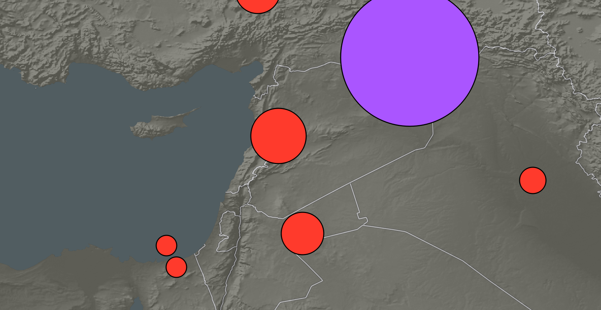

That’s it for the map design.  It looks sparse for now, but once we export the layers and import them in to Inkscape, we can start arranging the circles and adding labels.

59. Save the QGIS Project as ‘Syria Map.qgs’ in your lab directory.

### Task 3 Export Map by Layers

In this task, you will export the map in two parts: one part for the base map, and one part for the proportional symbols.  The reason two exports are required is the raster hillshade and the transparency effects of the vector layers cannot be exported to PDF as a vector file; to maintain these effects, the export must first be rasterized, which prevents us from getting access to the vector data.  Therefore, we will export the proportional symbol layers separately as we will want to move and manipulate them.

1. In QGIS, with the Syria Map project loaded, turn off the visibility of the Refugees and IDPs layer so that only the basemap remains.
2. Click Project | New Print Composer.
3. Title the print composer ‘Syria’ then click OK.  This will open the Print Composer.
4. Click Composition tab in the information panel.
5. Set the following Paper and quality properties on the Composition tab:
	+ Presets: Custom
	+ Width: 220
	+ Height: 205
	+ Units: mm
	+ Orientation: Landscape
	+ Page background: 
		+ Symbol layers: Simple fill
			+ Fill style: No Brush
				+ Border style: No Pen
	+ Print as raster: checked.  This will be checked for our first export of the basemap.  Since we won’t need to modify the vector information on the basemap in Inkscape, we will rasterize it.
6. Click ‘Add new map’ button on the Composer Items toolbar.  Drag a large box on the Composition View.  
7. Click Item properties tab and set the following properties:
	+ Scale: 3500000 (3.5 million)
	+ Position and Size:
		+ X: 0
		+ Y: 0
		+ Width: 220
		+ Height: 205
	+ Background: unchecked
8. Use the ‘Move item content’ tool 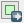 on the Composer Items toolbar to center the map around Syria.  Your composition should look similar to the figure below.

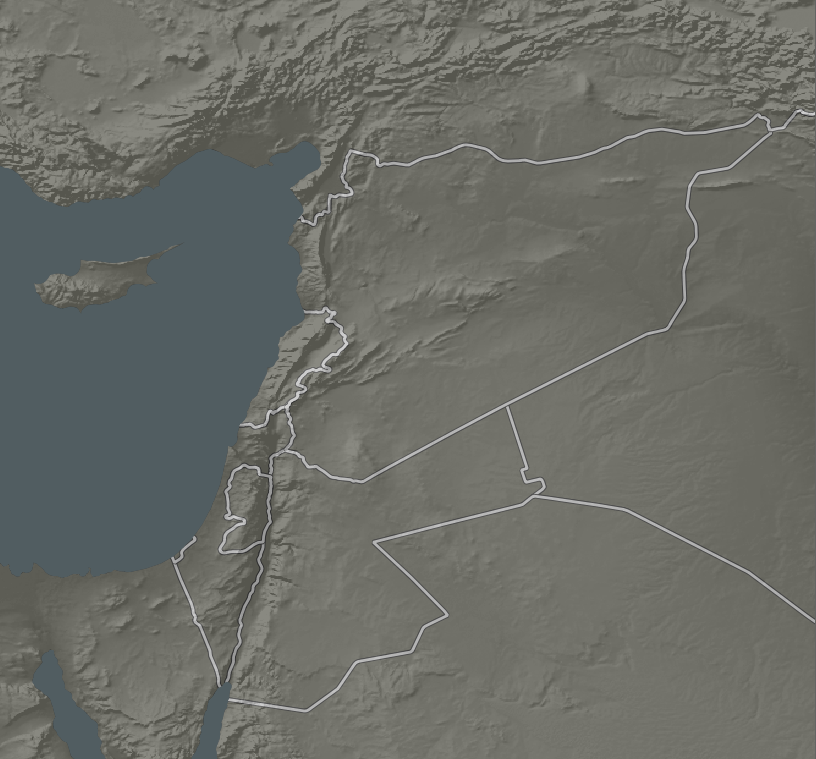

9. With the map composed, click Composer | Export as PDF… from the file menu.  
10. Name the PDF ‘Syria Basemap.pdf’ and save it in your lab directory.

Now we will hide the basemap, only show the proportional symbols, and export the map as a vector PDF.

11. Close the Print Composer and return the QGIS.
12. Turn off the visibility for the basemap, hillshade, ocean, and coastline layers, and turn on the visibility for Refugees and IDPs layers.
13. Click Project | Print Composers | Syria to re-open the print composer.  Your map should look like the figure below.
	+ If the composition does not update, select the map, then click Item Properties | Update preview button.

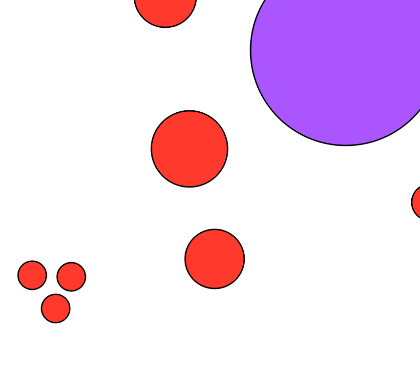

14. Click Composition tab.
15. Uncheck ‘Print as raster’.  We have this unchecked because we want to export these proportional symbols as vector objects in the PDF so we can manipulate them in Inkscape later.
16. With the proportional symbols composed, click Composer | Export as PDF… from the file menu.  
	+ If a ‘Project contains composition effects’ window appears, uncheck ‘Print as raster’ then click Close.
17. Name the PDF ‘Syria Proportional Symbols.pdf’ and save it in your lab directory.

That is all we need to do for composing the map in QGIS.  Normally you would leave QGIS open so you can query the attributes for labeling the country names and proportional symbol values, however, this will be provided for you in the next lab when you complete the map design, so you can close QGIS and Print Composer to save system resources.

### Task 4 Prepare Rough Map Design in Inkscape

In this task, you will start the map design process in Inkscape by importing all of the resources you will need to construct the map.  You will complete the map design in the next lab.

1. Open Inkscape.
2. Click File | Document Properties.  Click Page tab.
3. The final map design is for a 15in. wide by 10in. tall piece of paper.  We will set the page dimensions in this dialog.  Set the following options:
	+ Units: in
	+ Width: 15.0
	+ Height: 10.0
	+ Show border shadow: unchecked
4. Close the Document Properties dialog.  The page size is now set.
5. Click View layers button 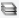 on the command bar to open the Layers panel.
6. Rename ‘Layer 1’ to ‘Basemap’.  
7. Import the Syria Basemap.pdf that was exported in Task 3.
8. Click Align and distribute objects button  on the command bar to open the Align and Distribute panel.  
9. Align the basemap to the right and bottom of the page.
10. With the basemap in place, lock the Basemap layer by clicking the open lock next to the layer in the Layers panel.  This will prevent us from accidentally selecting or moving the basemap.
11. Create a new layer, name it ‘Proportional Symbols’ and place it at the top of the Layer list.
12. Import Syria Proportional Symbols.pdf  into the newly created layer.
13. Align the Proportional Symbols layer to the right and bottom of the page.
14. Lock the Proportional Symbols layer.
15. Create a new layer, name it ‘Graph’ and place it at the top of the Layer list.
16. Import Bar Graph.jpg.  When prompted, choose ‘embed’ and click OK to add the graph image to the composition.
17. The graph imports as a large image.  We will scale it down to 145mm x 90mm as we had planned in Task 1 (refer to the layout sketch figure).  In the tool controls bar (below the menu bar), we will set the W(idth) and H(eight) value.  First, click the lock to maintain the aspect ratio, then set the units to ‘mm’, finally set the W(idth) to 145 and press Enter on your keyboard.  The graph will resize. Refer to the figure below to see the final settings.

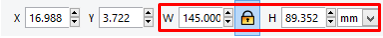

18. Align the graph to the left and bottom of the page.  You can do this with the Align and Distribute panel, or, set the X and Y values next to the Width and Height values to 0,0 (X, Y value location shown in the figure above).
19. Lock the Graph layer.
20. Create a new layer, name it ‘Pictures’ and place it at the top of the Layer list.
21. Import and embed Picture 1.jpg, Picture 2.jpg, and UNHCR Logo.jpg into the Pictures layer.
22. Set the height of each picture to 45mm with proportional scaling enabled (locked lock).
23. Place Picture 1.jpg and Picture 2.jpg above the Graph.
24. Set the proportionally scaled UNHCR logo to 30mm high.
25. Place the UNHCR logo in the top left corner of the page.
26. Lock the Pictures layer.
27. Save the Inkscape document and name it ‘Syria Refugee and IDP Map.svg’.
28. Your map should resemble the figure below.

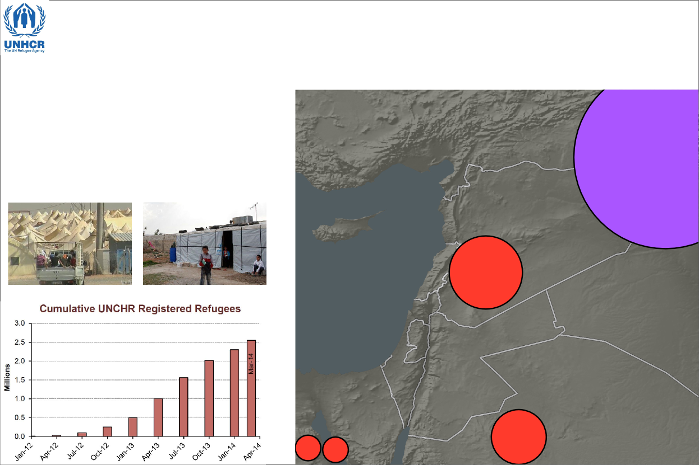

All of the graphic assets have now been added to the map.  In the next lab, you will complete the map design.

### Task 5 Challenge: Create Layout in QGIS (optional)

While we are using Inkscape to complete final designs of our maps, QGIS does allow for some advanced map design.  To do a comparison, create a new Print Composer and import all of the assets that were imported in Task 4, as well as the Syria map.  See if you can re-create the map we created in Inkscape in QGIS’s Print Composer.  Export your design as a rasterized PDF and submit for grading.

### 3 Conclusion

In this lab, you learned about the importance of thinking about the map design and layout for planning purposes.  Next, you learned how to use QGIS to create a proportional symbol map and additional Print Composer options and export strategies. Lastly, in Inkscape, you learned how to import assets to different layers to create a rough map design.  There is still quite a bit of work ahead of you in the next lab where you will add text, neatlines, legend, labels, and modify the proportional symbols.

### 4 Discussion Questions

1. Save your Inkscape map as a PDF and submit it for grading.
2. The basemap was exported in QGIS as a raster file because transparency is not supported for vector data, and the hillshade is a raster.  Suppose you wish to export the hillshade as a rasterized PDF and the ocean, coastline, and country boundaries as a separate vector PDF.  Discover and list the steps to how you would achieve the transparency effect in Inkscape so the hillshade would show through the vector basemap layers.
3. In Inkscape, open the Align and Distribute panel.  The ‘Relative to:’ dropdown box lists seven options.  Become comfortable with how each of these options change the way the alignment buttons work.  List the seven ‘Relative to:’ options and explain how each one works.