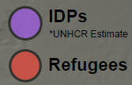

# GST 104: Cartographic Design
## Lab 5: IDP and Refugee Proportional Symbol Map – Designing the Final Map
### Objective - Utilize Inkscape to Complete the Design of a Proportional Symbol Map Showing Syrian IDPs and Refugees

Document Version: 5/10/2015

**FOSS4G Lab Author:**
Richard Smith, Ph.D., GISP
Texas A&M University - Corpus Christi

**Original Lab Content Author:**
Richard Smith, Ph.D., GISP
Texas A&M University - Corpus Christi

---

The development of the original document was funded by the Department of Labor (DOL) Trade Adjustment Assistance Community College and Career Training (TAACCCT) Grant No.  TC-22525-11-60-A-48; The National Information Security, Geospatial Technologies Consortium (NISGTC) is an entity of Collin College of Texas, Bellevue College of Washington, Bunker Hill Community College of Massachusetts, Del Mar College of Texas, Moraine Valley Community College of Illinois, Rio Salado College of Arizona, and Salt Lake Community College of Utah.  This work is licensed under the Creative Commons Attribution 3.0 Unported License.  To view a copy of this license, visit http://creativecommons.org/licenses/by/3.0/ or send a letter to Creative Commons, 444 Castro Street, Suite 900, Mountain View, California, 94041, USA.

This document continues to be modified and improved by generous public contributions.

---

### 1. Introduction

In this lab, the student will complete the map design discussed and started in Lab 4.  This map will show Syrian Internally Displaced Persons (IDPs) and Refugees.  The figure below shows an example final product that will be completed in this lab.

This lab will focus primarily on arranging map elements, creating a legend, adding transparency effects, and properly aligning all map elements.The layout designed for this map may be partially re-used for a related choropleth map designed later in Lab 6.

It is assumed that the student has completed labs 1, 2, 3, and 4 and has a working knowledge of Inkscape and QGIS.  Because of this assumption, the student will be asked to complete tasks that were covered in the previous labs without being provided step-by-step instructions.  Tasks that have not been covered in previous labs will be covered in detail in this lab.

Acknowledgement: The author would like to thank Mr. Olivert Garcia for allowing his Syria IDP and Refugee map design to be used as a teaching tool.

This lab includes the following tasks:

+ Task 1 – Arrange Proportional Symbols and Apply Transparency
+ Task 2 – Add Labels
+ Task 3 – Create Legend, Metadata, Title, Ancillary Text, and Neatlines
+ Task 4 – Final Checks for Alignment and Map Export
+ Task 5 - Challenge: Add Refugee Camps to the Map

### 2 Objective: Utilize Inkscape to Complete the Design of a Proportional Symbol Map Showing Syrian IDPs and Refugees

To achieve a properly designed map, the features on the map must be easily distinguishable, attractive to the map reader, and stand out from the grounds (supporting background information/data).  In this lab, the student will learn how to utilize Inkscape to compose a well-designed proportional symbol map.  

### Task 1 Arrange Proportional Symbols and Apply Transparency

The first task we will tackle is completing the design and layout of the proportional symbols.  There are four issues we need to resolve: addition of Iraq and Turkey symbols, removal of duplicated Egypt symbol, placement for symbols, and transparency of symbols.  We will tackle these issues in the order listed.

*One thing to note before you begin.*  Depending on the scale and extent of the map as set in QGIS, you may have more, or less circles than what is displayed and instructed in this lab.  If so, either add and scale, or remove symbols as appropriate.

1. There is no data for this lab.  You will use the ‘Syria Refugee and IDP Map.svg’ Inkscape file that you completed in lab 4.  Create a new lab directory to store the output of this lab.
2. Open Inkscape.  Open ‘Syria Refugee and IDP Map.svg’ that you completed in lab 4.  The figure below displays the map design at the end of lab 4.

3. Open the Layers Panel and unlock the ‘Proportional Symbols’ layer.  It is best to keep all other layers locked so you don’t accidentally move or edit them.
4. Use the Select tool  to select the Proportional Symbol layer on the map.  
5. Click the Ungroup selected groups button  multiple times until you see the selection boxes around the individual proportional symbols.
6. Select the proportional symbol representing Lebanon.  We will duplicate this symbol twice; once to use as Turkey’s symbol, and once to use as Iraq’s symbol.
7. Right-click on the selected proportional symbol then select Duplicate.  Do this a second time.
8. Drag one proportional symbol in to Turkey, and the second in to Iraq.  

Now that Turkey and Iraq have symbols, we need to set them to their correct relative sizes.  Recall that:

+ Lebanon: 980,731 Refugees
+ Turkey: 647,379 Refugees
+ Iraq: 226,934 Refugees
+ 
We can use these values to scale the Turkey and Iraq symbols down to their proper size by determining the ratio of sizes.  If we divide the Turkey refugee population by the Lebanon refugee population, then multiply the area of Turkey’s symbol by that percentage, we will have the proper symbol size.  The same would work for Iraq’s symbol.  Let’s do this now.

9. Divide Lebanon’s refugee population in to Turkey’s refugee population (647,379/980,731).  You should get the decimal 0.66 which represents Turkey’s refugee population being 66% the amount of Lebanon’s.  
10. Select Turkey’s symbol and note the width and height values in the Tool Controls Bar.  The symbol is 144px wide by 144px high.  Since symbols are scaled in proportion to their areas, we need to first calculate the size of the circle, then scale it.  So, we are left with this equation and solution to scale the proportional symbol: 
	+ SquareRoot(r^2*ratio)
	+ SquareRoot(144^2*.66)
	+ SquareRoot(20,736*.66)
	+ SquareRoot(13,685.76)
	+ 116.98
11. Set the width and height of Turkey’s symbol to 117 (rounding up from 116.98).
12. Repeat these steps to properly set Iraq’s symbol size.

Notice that when you scaled the proportional symbol for Turkey and Iraq, their outline thicknesses decreased and they now look inconsistent with the other proportional symbols (see figure below for illustration).  This can easily be fixed by re-setting the outline thickness to the width of the original outline.

13. Select Lebanon’s symbol.  
14. Open the Fill and Stroke Panel by clicking  on the Commands Bar.
15. Click ‘Stroke style’ tab.  Note that the thickness is 2.657 px.
16. Select Turkey’s symbol.  In the Fill and Stroke Panel, set the thickness to 2.657 px.
17. Repeat the above step for Iraq’s symbol.

Great, now we can remove the duplicated Egypt symbol.

18. Select one of the two Egypt symbols in the lower-left corner of the map.
19. Right-click on the selected symbol and choose Delete, or, press the ‘Delete’ key on your keyboard.  In either case, the duplicated Egypt symbol will be deleted.

Now that we have the correct number and size of proportional symbols, we will move and arrange them on the map for maximum impact and attractiveness.

20. Use the Select tool to arrange the symbols similar to the figure below.  
21. To make the purple symbol to sit underneath the red symbols, we will need to send it to the bottom of the draw order.  Select the purpose symbol, then click Object | Lower to Bottom from the File Menu.

The last issue to tackle for the symbols is setting the transparency.  While it is possible to set the transparency (or, opacity) for each individual symbol, we will set the layer’s opacity, which will set the opacity for every symbol at once.  This provides a quick, simple way to apply a consistent opacity level to all objects on a layer.

22. Open the Layers Panel if it is not already open.
23.	Select ‘Proportional Symbols’ layer.
24. Set Opacity, % to 60.0.  The symbols will now be semi-opaque and you can see the borders and terrain underneath.
25. Lock the ‘Proportional Symbols’ layer so you don’t accidentally modify them.

We now have our symbols in a good location, have the opacity set so you can see the terrain and boundaries behind them, and the red symbols cut in to the purple symbol.  We will now move on to labeling the countries and symbols.

### Task 2 Add Labels

In this task, you will add labels for both the countries and proportional symbols.  The countries will be labeled with their names in white and all capital letters, and the proportional symbols will be labeled with the number of IDPs or Refugees that they represent in black.  You will create the country labels first.

1. In the Layers Panel, create a new layer named ‘Map Labels’.
2. Place the layer at the top of the layer list.
3. Select the Text tool  in the Toolbox.  The Tool Controls Bar will change to reflect that the Text tool has been selected.  
4. Set the font to ‘Arial’ and font size to ‘18’ in the Tool Controls Bar.  Reference the figure below for the settings.

5. After typing text on the map, set the fill color to pure white by either:
	+ Clicking the pure white on the palette at the bottom of Inkscape
	+ Opening the Fill and Stroke Panel  and setting the Fill RGB color to 255,255,255.
6. Label the following countries in all capital letters.  All labels should be white and 18 point font, except where noted.  Refer to the figure below for placement.

	+ Turkey
	+ Cyprus
	+ Lebanon
	+ West Bank -14 pt font size – Title Case
	+ Gaza Strip - 14 pt font size – Title Case
	+ Egypt
	+ Israel
	+ Jordan
	+ Saudi Arabia
	+ Iraq
	+ Syria

7. Label the proportional symbols with the following properties (reference the figure below for placement example):
	+ Font: Arial
	+ Color: Black
	+ Font Size: 32
		+ Syria: 6.5 Million*
	+ Font Size: 22
		+ Lebanon: 980,731
		+ Turkey: 647,379
		+ Jordan: 587,308
	+ Font Size: 16
	+ Iraq: 226,934
	+ Font Size: 12
	+ Egypt: 135,410

Great!  The labels are now completed.  Now we will align the proportional symbol labels to the center of each symbol, and re-adjust the locations of the country names, if required.  I will demonstrate how to align Syria’s purple proportional symbol label and symbol.

8. In the Layers Panel, unlock the ‘Proportional Symbols’ layer.
9. Open the Align and Distribute Panel by clicking the Align and distribute objects button  on the Commands Bar.
10. Select the purple proportional symbol, then, holding down the Shift key on your keyboard, select the ‘6.5 Million*’ label.
11. In the Align and Distribute Panel, Set ‘Relative to’ to ‘First selected’.
12. Click ‘Center on vertical axis’ button  followed by ‘Center on horizontal axis’ button . This will align the label to the symbol. 
	+ If the symbol aligned to the label, undo the movement, and change from ‘First selected’ to ‘Last selected’ as order of selection counts and you selected the proportional symbol last.  Then, set the alignment.
13. Align all other symbol labels to the horizontal and vertical centers of their associated symbols.
14. Lock the ‘Proportional Symbols’ layer again to prevent accidental modifications.
15. Move the country labels if they are crowding the symbol labels.
16. When done setting the label locations, lock the ‘Map Labels’ layer.

Your map body design is now completed.  It should look similar to the figure below.

### Task 3 Create Legend, Metadata, Title, Ancillary Text, and Neatlines

In this task, you will create the legend, metadata, title, ancillary text, and neatlines.  We will continue to rough all of these items in and will fine-tune the alignments in Task 4.  Let’s start by creating the Metadata.

1. Create a new layer and name it ‘Metadata’.  Make sure it is above at least Basemap in the layers list.
2. Use the Text tool  in the toolbox and the Text and Font Dialog  in the Commands Bar to add the following text with the associated properties: (as seen in the figure below)
	+ Font: Arial
	+ Font Size: 10
	+ Color: Black
	+ Layout: Center lines
	+ Text: 

		+ Data Sources  
		  data.unhcr.org & hui.state.gov March 2014  
		  Made with Natural Earth.  Free data at naturalearthdata.com

3. Place the metadata at the bottom of the map body either centered, or right-of-center.
4. Lock the Metadata layer.

Next, let’s create the map legend, which will identify the meaning of the proportional symbols’ colors.  The map legend will contain two circles, one red, one purple, which will represent the two variables the proportional symbols represent.  Next to the proportional symbols will be the text explanations.  The figure below shows the legend design.

To accomplish this design, we can either: a) copy and paste one red and one purple symbol and reduce its size; or b) draw new circles and set their properties to match the proportional symbols.  I will show you both options, and you choose whichever you want to use.

*Option a: Copy and paste*

1. Create a new layer named ‘Legend’ and place it at least above the Basemap layer.
2. Unlock the ‘Proportional Symbols’ layer.
3. Select a red symbol and click Edit->Copy from the file menu.
4. Select ‘Legend’ as the active layer by either selecting ‘Layer’ from the layer combo box in the Status Bar, or, selecting the layer in the Layer Panel.
5. Click Edit | Paste to paste the symbol on the ‘Legend’ layer.  Turn the layer visibility off and on to verify that the symbol is on the ‘Legend’ layer.  If it is not, select it, then hold Shift on your keyboard and press Page Up (or page down) until it is on the Legend layer.
6. Repeat steps 3-5 to copy the purple symbol.
7. Set the width and height of both legend symbols to 40px.
8. Set the Stroke Width of the legend symbol to 2.657so it matches the stroke width of the larger symbols.

*Option b: Draw new circles*

1. Create a new layer named ‘Legend’ and place it at least above the Basemap layer.
2. Select the Ellipse tool  from the Toolbox.
3. While holding Control key on your keyboard, click and drag to create a circle.  The control key keeps the ratio to integers.
4. Select the ellipse and set the width and height to 50px.
5. Open the Fill and Stroke Panel and set the following options:
	+ Fill tab:
		+ R: 255
		+ G: 58
		+ B: 44
		+ Opacity: 80
	+ Stroke paint tab:
		+ R: 0
		+ G: 0
		+ B: 0
	+ Stroke style tab:
		+ Width: 2.657 px
6. Repeat steps 2-4 to create a second ellipse and set the following options:
	+ Fill tab:
		+ R: 170
		+ G: 85
		+ B: 255
		+ Opacity: 80
	+ Stroke paint tab:
		+ R: 0
		+ G: 0
		+ B: 0
	+ Stroke style tab:
		+ Width: 2.657 px

*Note*: In option b, we set the opacity for each symbol.  In option a, we did not, because when we copy and pasted each symbol, it copied the opacity value from its parent layer’s opacity value.  Instead of setting each symbol’s opacity in option b, you can simply set the ‘Legend’ layer’s opacity to 80.

*Complete the following steps after you complete option a or option b above.*

9. Move the symbols to the bottom-right corner of the map body but leave room for the explanatory text.
10. Align the two legend symbols vertically to each other.
11. Add the following text next to the purple legend symbol:
	+ Font: Arial
	+ Font Size: 22
	+ Font Style: Bold
			+ Text: IDPs
	+ Font Size: 12
	+ Font Style: Normal
	+ Location: Under ‘IDPs’ text.
		+ Text: *UNHCR Estimate
12. Add the following text next to the red legend symbol:
	+ Font: Arial
	+ Font Size: 22
	+ Font Style: Bold
		+ Text: Refugees
13. Align the legend text to the horizontal center of their respective symbols.
14. Align the left character of each legend text to each other.
15. Move the entire legend to the lower-right corner of the map.
16. Lock the ‘Legend’ layer.

With the legend created, now let’s turn our attention to the title.

17. Create a new layer named ‘Title’.
18. At the top of the map layout, create the following title text with the following properties:
	+ Font: Arial
	+ Font Size: 48
	+ Style: Bold
	+ Color:
		+ R: 99
		+ G: 44
		+ B: 40
	+ Text: Syrian Refugees & Internally Displaced Persons
19. Below and vertically centered with the title, create the subtitle text with the following properties:
	+ Font: Arial
	+ Font Size: 22
	+ Style: Bold
	+ Color:
		+ R: 99
		+ G:44
		+ B: 40
	+ Text: 2011 – 2014
20. Lock the ‘Title’ layer.

Next up is the ancillary text.

21. Create a new layer named ‘Ancillary Text’.
22. Above the two photos, create the following text with the following properties:
	+ Font: Arial
	+ Font Size: 19
	+ Color:
		+ R: 0
		+ G: 0
		+ B: 0
	+ Text: *The United Nations High Commissioner for Refugees
(UNHCR) defines refugees as individuals who are outside
their country of nationality or habitual residence because of
persecution, war, or violence. Internally displaced persons
(IDPs) are defined as persons who have been forced to flee
their home for the same reason as a refugee, but remain in
their own country and have not crossed an international
border.*
23. Above the two photos, below  and vertically centered with the ancillary text paragraph, create the following text with the following properties:
	+ Font: Arial
	+ Font Size: 22
	+ Style: Bold
	+ Color:
		+ R: 99
		+ G: 44
		+ B: 40
	+ Text: Total Persons of Concern: 9.36 Million
24. Lock the ‘Ancillary Text’ layer.

Your map should currently resemble the figure below.

Last map element is the neatlines.  There will be four neatlines on this map that surround the graph, title, map body, and entire map layout.  Since we will use the neatline that surrounds the entire map layout as an anchor for the other neatlines, we will start there.

25. Create a new layer named ‘Neatlines’ and place it at the top of the layers list.
26. Select the Rectangles and squares tool  from the Toolbox.
27. Draw a large rectangle on the map layout.  Don’t worry about having it completely surround the the elements, we will let Inkscape do that heavy lifting.
28. Set the size of the neatline to be 15 in wide and 10 in high.  Set both the X and Y origins to 0.  Remember you can set these properties on the Tool Controls Bar at the top of Inkscape when the neatline is selected.  See the figure below.

29. Set the Fill color to No paint .
30. Set the Stroke Width to 3.5 px.

Now we will create a neatline around the title, graph, and map.

31. Use the Rectangles and squares tool  to draw neatlines around the title, graph, and map body.  Set the fill to No paint, and stroke width to 1.5px.  Your neatlines should look similar to the ones in the figure below.
32. Lock the ‘Neatlines’ layer.

That’s it for the map elements!

### Task 4 Final Checks for Alignment and Map Export

Now that all of the map elements have been added to the map, we are ready for final tweaking of placement of elements and alignment between elements.  In this Task, you will use the Align and Distribute Panel to align the map elements.  Humans are really good at noticing slight mis-alignments, therefore, we want to avoid mis-alignments so map readers do not lose confidence in our map.

As you already have quite a bit of experience in aligning objects in Inkscape, this Task will provide general guidelines for aligning map elements.  The figure below displays guidelines for the alignment of map elements and what is considered the final map design.  Each guideline represents an alignment operation.  The guidelines can be created by dragging from the left or top ruler down on to the composition.  Guidelines can be deleted by selecting them then pressing Delete key on your keyboard.

Using the above figure as a guide, and using the Align and Distribute Panel, align the map elements.  You will need to unlock layers for alignment.  If you want to manually move an element a small distance, select the element, then use the arrow keys on your keyboard to nudge the element in the related direction.

### Task 5 Challenge: Add Refugee Camps to Map (optional)

The United States Department of State Humanitarian Information Unit provides GIS data of Syria Refugee Camps in Turkey, Iraq, and Jordan.  The March 12th, 2014 data set is provided to you in Lab 5 Data folder.  Using QGIS and the Refugee Camp data, create a new layer for the map created in this lab, and add it to the map, along with an associated legend and modified metadata statement.  The new layer should show the locations of all camps, and the camps should have different symbology based on the designation in the ‘DESIGNATION’ field of the data.  

The data was downloaded from <https://hiu.state.gov/data/data.aspx>

Here is the data’s abstract:

>The "Syria Refugee Camps" dataset contains verified data about the geographic location (point geometry), name, and operational status of refugee camps hosting Syrian refugees in Turkey, Jordan, and Iraq. Only refugee camps operated by the United Nations High Commissioner for Refugees (UNHCR) or the Government of Turkey are included. Compiled by the U.S Department of State, Humanitarian Information Unit (INR/GGI/HIU), each attribute in the dataset (including name, location, and status) is verified against multiple sources. The name and status are obtained from the UNHCR data portal (accessible at http://data.unhcr.org/syrianrefugees/regional.php). The locations are obtained from the U.S. Department of State, Bureau of Population, Refugees, and Migration (PRM) and the National Geospatial-Intelligence Agency's GEOnet Names Server (GNS) (accessible at http://geonames.nga.mil/ggmagaz/). The name and status for each refugee camp is verified with PRM. Locations are verified using high-resolution commercial satellite imagery and/or known areas of population. Additionally, all data is checked against various news sources. Locations are only accurate down to the city level. The designation field gives the type of site and the status of the site. Sites can be "Official Camps", camp settlements that are officially established and maintained by the United Nations or host country. Sites can also be "Transitional Camps", which is a typical camp structure but designed to be temporary or used on as needed basis. There can also be "Transitional Facilities"; these are facilities that are being used to temporarily house refugees. There can also be other sites such as host families or facilities, or other accommodations. Status of these sites can be Planned, Under Construction, Staged, Open, or Closed. The data contained herein is entirely unclassified and is current as of 12 March 2014. The data is updated as needed.

### 3 Conclusion

In this lab, you used Inkscape to complete the map design of IDPs and Refugees of Syria.  By separating the map elements by layer, you were able to logically place, lock, and modify properties of the layers’ objects.  In addition to map layout, you also added labels, copied and pasted objects, and aligned map elements for a clean, professional look.  At this point, you know enough of Inkscape’s commands to complete the majority of what would normally be done to complete a map.  

### 4 Discussion Questions

1. Save your Inkscape map as a PDF and submit it for grading.
2. Discuss the lack of north arrow, scale bar, and locator map on the map you created in this lab.  Do you think leaving off these three map elements is a mistake? Why/why not?  If you would include one of these map elements on the map, explain why and how you would expect your map reader to utilize the added map element.
3. If you were provided the data to create the Syrian Refugee & Internally Displaced Persons map, but were forbidden to create a proportional symbol map, what other map type would you choose to create this map?  Why would your chosen map type be appropriate?  Additionally, list one map type that would not be appropriate for portraying the data.