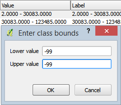
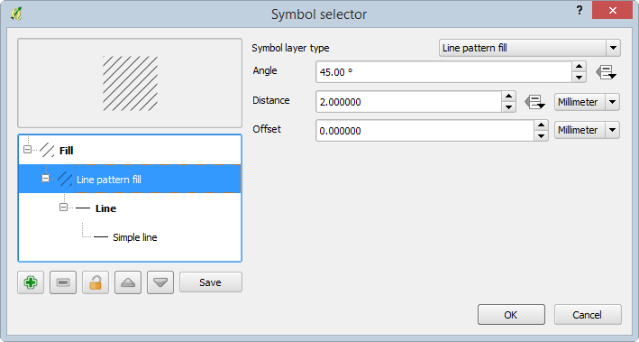
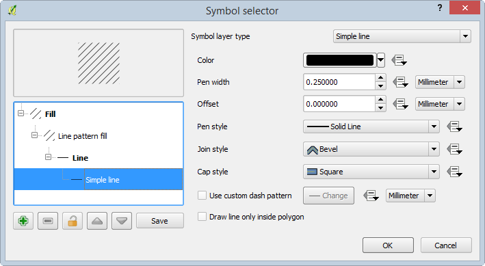
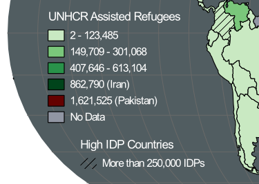

# GST 104: Cartographic Design
## Lab 6: Countries with Refugees and Internally Displaced Persons Over 1 Million Map Design
### Objective - Utilize QGIS and Inkscape to Design a Chorolpleth Map Showing Refugees and IDPs Over 1 Million

Document Version: 5/10/2015

**FOSS4G Lab Author:**
Richard Smith, Ph.D., GISP
Texas A&M University - Corpus Christi

**Original Lab Content Author:**
Richard Smith, Ph.D., GISP
Texas A&M University - Corpus Christi

---

The development of the original document was funded by the Department of Labor (DOL) Trade Adjustment Assistance Community College and Career Training (TAACCCT) Grant No.  TC-22525-11-60-A-48; The National Information Security, Geospatial Technologies Consortium (NISGTC) is an entity of Collin College of Texas, Bellevue College of Washington, Bunker Hill Community College of Massachusetts, Del Mar College of Texas, Moraine Valley Community College of Illinois, Rio Salado College of Arizona, and Salt Lake Community College of Utah.  This work is licensed under the Creative Commons Attribution 3.0 Unported License.  To view a copy of this license, visit http://creativecommons.org/licenses/by/3.0/ or send a letter to Creative Commons, 444 Castro Street, Suite 900, Mountain View, California, 94041, USA.

This document continues to be modified and improved by generous public contributions.

---

### 1. Introduction

In this lab, the student will construct a choropleth map showing worldwide refugee and internally displaced people (IDP).  As this is the penultimate lab for this lab series, this is the lab where the student will be ‘pushed from the nest’ so-to-speak and they will complete the final map layout without any instruction from this lab.  This lab will demonstrate how to design and export the final map design (shown in figure below), and the student will be challenged to complete the map layout in Inkscape by modifying the map layout designed in lab 5.

This lab will focus primarily on data classification, symbolizing figures and grounds, creating a legend, and exporting the data to Inkscape. 

It is assumed that the student has completed labs 1, 2, 3, 4, and 5 and has a working knowledge of Inkscape and QGIS.  Because of this assumption, the student will be asked to complete tasks that were covered in the previous labs without being provided step-by-step instructions.  Tasks that have not been covered in previous labs will be covered in detail in this lab.

This lab includes the following tasks:

+ Task 1 – Load and Symbolize Basemap Data
+ Task 2 – Classify and Symbolize Refugee Data
+ Task 3 – Symbolize IDP Data
+ Task 4 – Create Legend and Export Map
+ Task 5 - Design Map Layout using Inkscape

### 2 Objective: Utilize QGIS and Inkscape to Complete the Design of a Choropleth Map Showing Worldwide IDPs and Refugees

To achieve a properly designed map, the features on the map must be easily distinguishable, attractive to the map reader, and stand out from the grounds (supporting background information/data).  In this lab, the student will learn how to utilize QGIS  and Inkscape to compose a well-designed choropleth map.

### Task 1 Load and Symbolize Basemap Data

The first task we will tackle is loading all of the basemap data and symbolizing it so we have a nice ground to contrast with our figures that we will add in Tasks 2 and 3.

1. Open QGIS Desktop.
3. In QGIS Desktop, add the following vector layers to the project by clicking Layer | Add Layer | Add Vector Layer from the menu bar.  All of the layers have been projected in to EPSG:54012 - World_Eckert_IV, which is the projection we will use for this project.
	+ ‘Ocean.shp’
	+ ‘Graticules 15 Degrees.shp’
4. Order the Ocean layer below the Graticules 15 Degrees layer.
5. Set the following Style properties for the Ocean layer:
	+ Symbol layer: Simple fill
		+ Simple fill Color:
			+ Hue: 195
			+ Sat: 15
			+ Val: 40
		+ Border style: No pen
6. Set the following Style properties for the Graticules 15 Degrees layer:
	+ Symbol layer: Simple fill
		+ Simple line Color:
			+ Hue: 60
			+ Sat: 0
			+ Val: 40
		+ Pen width: 0.25

### Task 2 Classify and Symbolize Refugee Data

In this task, you will add the dataset containing the refugee and IDP population information.  

1. Add ‘UNHCR Assisted IDPS and Refugees by Country.shp’ to the QGIS Project.  Order this layer at the top of the Layers list.  This dataset contains two attributes of interest:
	+ Refugees: The number of refugees living within the country
	+ IDPs: The number of internally displaced persons (IDPs) living within the country.
2. Let’s take a look at the descriptive statistics of the Refugee field to get a feeling for its form.  Click Vector | Analysis Tools | Basic statistics to open the Basic statistics dialog.  We will use this dialog to run basic descriptive statistics on the Refugee field.
3. Set the following options in the Basic statistics dialog then Click OK to see the results shown in the figure below:
	+ Input Vector Layer: ‘UNHCR Assisted IDPS and Refugees by Country’
	+ Target field: ‘Refugees’

Reviewing the statistics, take note of the Mean, StdDev, Min, Max, and Median.  Because the Median is significantly lower than the Mean, that tells us that the data is negatively skewed.  The StdDev seems reasonable, if not a little large.  Finally, notice that the Min value is -99.  In this field, -99 represents a country with ‘No Data’ (aka. NULL).  Since -99 is a numeric value, it is being included in the basic statistics and is skewing our data.  Additionally, the Max value is more than 9 times the standard deviation!  This makes the maximum value seem like a prime candidate for being an outlier that we should handle separately.

4. Open the Attribute table and sort the Refugee field in descending order.  Note that the largest value is almost twice the next largest value (shown in figure below).

It turns out that Pakistan is the country with the largest refugee population.  Because it is so much larger than the rest of the data, we will treat it separately for classification and statistics purposes.  Additionally, we should exclude the -99 values when we run our basic statistics and classification.  Let’s do that now.

5. Right-click on the UNHCR… layer in the Layers list and choose Filter….  This opens a Query Builder dialog.
6. Enter the following expression to exclude Pakistan and -99 values.
	+ "admin" != 'Pakistan' AND "Refugees" != -99
7. Click OK to apply the filter.  Note that Pakistan and the countries with -99 refugees are now missing from the map and attribute table.
8. Re-run the Basic Statistics from steps 2 and 3.  The results are shown in figure below.

Review the basic statistics again.  Note that they have changed quite significantly.  The N value reduced from 177 to 151 which means that 26 countries were filtered out.  While the Mean stayed roughly the same, the Median increased by 1,569, and the StdDev decreased by 38,891.  These set of statistics give us a better understanding of the nature of the data and will help guide us when classifying the data.  Let’s classify the Refugee data now.

9. Close the Basic statistics dialog.
10. Open the Style properties for the UNHCR… layer.
11. Set the following Style properties (shown in figure below):
	+ Classification type: Graduated
	+ Column: Refugees
	+ Symbol: Click ‘Change…” button
		+ Simple fill:
			+ Border width: 0.3.
	+ Classes: 5
	+ Color ramp: Greens
	+ Mode: Natural Breaks (Jenks)
12. Click ‘Classify’ button to classify the data.

13. Click OK to apply the style to the map.

Notice that there is quite a bit of white on the map that is a bit overpowering.  Additionally, Pakistan and the -99 countries are still missing.  Let’s re-introduce and symbolize the missing countries while removing the white class.

14. Clear the Filter for the UNHCR layer.
15. Open the Style properties for the UNHCR… layer.
16. Uncheck 'Link class boundaries'. This will allow us to introduce gaps between classes.
16. Since the first two classes only range from 2 to 123,485, which is within the first standard deviation, let’s combine those two classes and re-use the lowest class for the -99 countries.  Double-click on the values for the lowest class (2.00 – 30083.00) to edit the class bounds.  
17. Set the Lower value and Upper value both to -99 then click OK to set the new class bounds.  See figure below for reference.

18. Double-click on the values for the second-lowest class (30083.0000 – 123485.0000) to edit the class bounds.
19. Set the Lower value to 2.0 then click OK to set the new Lower class bound.
20. Let’s symbolize the -99 data as a grey color so it looks different from the refugee data; a different hue represents a different ‘type’ of thing, and, no data is different from data..  Double-click on the symbol for the -99 - -99 class to open the Symbol selector. 
	+ Set the following Symbol properties:
		+ Simple fill:
			+ Fill Color:
				+ Hue: 223
				+ Sat: 10
				+ Val: 65
			+ Border width: 0.3
21. Click ‘Add class’ to add a new class to the style.  We will set this class to represent Pakistan.
22. Change the Lower value and Upper value of the class both to 1621525.
23. Let’s symbolize the Pakistan country as a maroon color so it looks different from the refugee data and can have attention drawn to it.  Double-click on the symbol for the 1621525.0000 – 1621525.0000 class to open the Symbol selector. 
	+ Set the following Symbol properties:
		+ Simple fill:
			+ Fill Color:
				+ Hue: 4
				+ Sat: 100
				+ Val: 40
			+ Border width: 0.3
24. Click OK to apply the style to the map.  Your map should now resemble figure below.

25. Re-open the style properties for the UNHCR… layer.

Let’s review the classification as it stands now.  Refer to figure below for a screenshot of the classification.  I’d like to make three observations: 1) the labels do not reflect the classification anymore; 2) there are overlapping class boundaries (which class does 301068.0000 below to, for instance?); 3) the class boundaries represent no gaps between the classes (i.e. the class boundaries do not always represent actual data values).

Let’s address all three observations by a) changing the class boundaries to represent actual minimum and maximum values, b) updating the labels to represent the new class boundaries.  By sorting the Refugee column values in the attribute table, we can see that the lower boundaries for the top three classes are all wrong (123485 and 301068 do not exist, and 613104 is the upper boundary for the previous class).  Let’s change them.

26. Set the lower boundary values for the top three classes so the classes are the same as shown in the figure below.

27. Now that all of the classes are set, we should update the Label field to reflect the changes we made.  Set the following label values as shown in the figure below.  Essentially you are:
	+ removing the decimal numbers
	+ adding thousands separators
	+ changing -99 to No Data
	+ identifying Pakistan and Iran by name since they are in classes by themselves and, as they are the highest values, might be countries of interest and easy identification.

### Task 3 Symbolize IDP Data

With the refugees mapped, now we will map the countries with IDPs numbering over 250,000 so we can bring special attention to those countries.  As we have already assigned a fill color to each country, we need to get creative in how we can show which countries have over 250,000 IDPs.  Let’s overlay a hachure on the countries with high IDP values.

1. Duplicate the UNHCR… layer by right-clicking the UNHCR… layer in the Layers list then choosing Duplicate.
2. Turn on layer visibility for the original UNHCR… layer.
3. Rename the top UNHCR… layer to ‘High IDP Countries’.
4. Open the style properties for the ‘High IDP Countries’.
5. For Column, change from ‘Refugees’ to ‘IDPs’.
6. Click Delete all button to remove all classes.
7. Click Add class button to add a single class.
8. Set the Lower value to 250000 and the Upper value to 4744096 (highest IDP value).
9. Change the class’ label to ‘More than 250,000 IDPs’
10. Double-click on the symbol for the class to open the Symbol selector. 
11. Set the following Symbol properties (shown in two figures below):
	+ Simple fill:
		+ Symbol layer type: Line pattern fill
		+ Distance: 2.0
		+ Line:
			+ Simple line:
				+ Color:
					+ Hue: 0
					+ Sat: 0
					+ Val: 0
				+ Pen width: 0.25

With all of the symbology now set, your map should look like the figure below.

11. Save your QGIS Project as ‘Worldwide Refugee and IDP Population.qgs’.

### Task 4 Create Legend and Export Map

With the map design complete, let’s create a legend then export the map in to Inkscape.

1. Click Project | New Print Composer and name it ‘Worldwide IDPs and Refugees’.
2. In the Composition Panel, under the Composition tab, set the following properties:
	+ Paper and quality
		+ Presets: ANSI A (Letter; 8.5x11 in)
		+ Orientation: Landscape
		+ Page background:
			+ Transparency: 100%
		+ Print as raster: unchecked
3. Add the map to the composition and make it the same size as the page.  Center the world on the page.
4. With the map selected, in the Composition panel, under the Item properties tab, uncheck ‘Background’ so that the background is transparent.

Now we will add the legend.

5. Click Add new legend button  and click on the map.  This will add the legend to the map.  Let’s change some basic legend properties before we dive in deeper.
6. With the legend selected, in the Composition panel, under the item properties tab, set the following properties:
	+ Main properties
		+ Title: (none)
		+ Background: unchecked
		+ Fonts:
			+ Subgroup font…
				+ Font: Arial
				+ Size: 11
			+ Item font…
				+ Font: Arial
				+ Size: 10
			+ Font color…
				+ Hue: 0
				+ Sat: 0
				+ Val: 100
		+ Symbol: 
			+ Symbol width: 6.00 mm
			+ Symbol height: 4.00 mm
7. Now let’s remove the Ocean and Graticules from the legend.  In the Item properties tab, under Legend items group:
	+ Uncheck 'Auto update'. This will allow us to change the contents of the legend.
	+ Select the Graticules 15 Degrees entry then press the remove button .  This will remove it from the legend.
	+ Remove the Ocean entry from the legend.
8. Let’s shorten the name for the Refugees layer and re-order the classes (the figure below shows the final configuration).
	+ Select UNHCR… entry and press the edit button .  
	+ Change the Item text to ‘UNHCR Assisted Refugees’.  
	+ Click OK.
	+ Select the No Data class, then press the Move down button  repeatedly until it is at the bottom.
	+ Move the Pakistan class just above the No Data class.

9. Place the legend on top of the world map, West of South America.  You map should resemble the figure below.

10. Export the map as a PDF named ‘Worldwide Refugee and IDP Population.pdf’.

### Task 5: Design Map Layout using Inkscape

Using what you have learned in all of the labs up to this point, design a final map layout in Inkscape.  In your final map layout, use any page size and orientation that you feel would be appropriate for the map.  Be sure to add ancillary text and metadata to explain your map (feel free to do some research online to add interesting text/pictures/graphs (cite your sources!)).  You may want to start by modifying the layout you designed in Lab 5 so that both maps look like they are part of the same map series, but this is not a requirement.

Additionally, modify the legend so that it looks like the legend in the figure below (*hint*: ungroup a few times to get access to the legend, then move it to its own layer).

Example ancillary text: 
>The United Nations High Commissioner for Refugees (UNHCR) defines refugees as individuals who are outside their country of nationality or habitual residence because of persecution, war, or violence. Internally displaced persons (IDPs) are defined as persons who have been forced to flee their home for the same reason as a refugee, but remain in their own country and have not crossed an international border. This Map the number of refugees  each country contains and IDPs in their respective countries of origin. All data are current as of mid-2013 or the latest available estimates.

Example metadata:

>Data Sources:  
data.unhcr.org  
naturalearthdata.com

### 3 Conclusion

In this lab, you viewed the descriptive statistics for an attribute, classified data, modified a the classification, designed a hachure symbol for multivariate mapping, designed a legend, and exported a map.  Additionally, you were challenged to create a map design in Inkscape.  

### 4 Discussion Questions

1. Save your Inkscape map from Task 5 as a PDF and submit it for grading.
2. In this lab, we used hachures to show the IDP variable.  What other visual variable could you have used to show the IDP variable on the map?  What would be the positives and negatives of the visual variable you chose?
3. The World Eckert IV map projection was used in this lab.  Was this a good choice for mapping at a global scale?  Identify at least two more map projections that would be appropriate for this type of thematic mapping.  For each map projection list the projection properties and explain why it would be appropriate.
4. How would you change the classification for the refugee variable?  Would you lump countries with less than 100 refugees in with countries with 123,000 refugees?  Would you separate out Iran and Pakistan?  Design a different classification scheme and explain how yours is an improvement on the one designed in this lab.