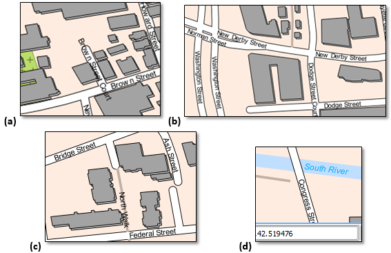

# GST 104: Cartographic Design
## Lab 7: Design and Label a Downtown Street Map
### Objective – Utilize QGIS and Inkscape to Design and Label a Street Map of a Downtown Area

Document Version: 5/10/2015

**FOSS4G Lab Author:**
Richard Smith, Ph.D., GISP
Texas A&M University - Corpus Christi

**Original Lab Content Author:**
Richard Smith, Ph.D., GISP
Texas A&M University - Corpus Christi

---

The development of the original document was funded by the Department of Labor (DOL) Trade Adjustment Assistance Community College and Career Training (TAACCCT) Grant No.  TC-22525-11-60-A-48; The National Information Security, Geospatial Technologies Consortium (NISGTC) is an entity of Collin College of Texas, Bellevue College of Washington, Bunker Hill Community College of Massachusetts, Del Mar College of Texas, Moraine Valley Community College of Illinois, Rio Salado College of Arizona, and Salt Lake Community College of Utah.  This work is licensed under the Creative Commons Attribution 3.0 Unported License.  To view a copy of this license, visit http://creativecommons.org/licenses/by/3.0/ or send a letter to Creative Commons, 444 Castro Street, Suite 900, Mountain View, California, 94041, USA.

This document continues to be modified and improved by generous public contributions.

---

### 1 Introduction

In this lab, the student will design and label a 1:2,500 scale downtown street map.  This lab will focus on teaching the student basic and advanced labeling techniques in QGIS.  Next, the student will, on their own, design a downtown street map of any city in Massachusetts.  The final map design should be designed using all techniques and concepts covered in this course.

It is assumed that the student has completed labs 1 thru 6 and has a working knowledge of Inkscape and QGIS.  Because of this assumption, the student will be asked to complete tasks that were covered in the previous labs without being provided step-by-step instructions.  Tasks that have not been covered in previous labs will be covered in detail in this lab.

This lab includes the following tasks:

+ Task 1 – Label Features using Basic QGIS Labeling Functions
+ Task 2 – Improve Labels using Advanced QGIS Labeling Functions
+ Task 3 – Complete Final Map Design
+ Task 4 - Challenge: Design and Label a 1:2,500 Scale Downtown Street Map

### 2 Objective: Utilize QGIS and Inkscape to Design and Label a Street Map of a Downtown Area

Labeling a map is one of the most time consuming, frustrating, poorly automated, and *important* tasks that a cartographer undertakes.  Labels should provide the map reader with important attribute information to assist them in properly using the map.  Poorly designed, or missing, labels can destroy a map’s usefulness and undermine its authority.  In this lab, the student will learn how to utilize QGIS to label features using both basic and advanced QGIS labeling functions.  The final product will be a well-designed street map of a downtown area.  

### Task 1 Label Features using Basic QGIS Labeling Functions

In this task, you will label roads, water, and parks using basic labeling techniques.  In Task 2, you will improve the labeling using advanced labeling techniques.

1. Open QGIS Desktop.
3. Open ‘Salem Downtown.qgs’ project.  This project contains multiple [OpenStreetMap][1] layers that have been clipped to downtown Salem, Massachusetts (shown in the figure below).  The map is set to 1:2,500 which is the planned print scale (if the scale is not 1:2,500, change it now).  Therefore, every design decision made must be with respect to producing at this scale, and this scale only.

[1]: http://www.openstreetmap.org

4. Open the Label Properties for the Waterways layer by right-clicking on the Layer in the Layers list, then choosing ‘Properties’ from the contextual menu, then choosing the ‘Labels’ tab.
5. Check ‘Label this layer with’ and choose ‘name’ as the labeling attribute.
6. Set the following label properties (shown in the figure below):
	+ Text:
		+ Font: Arial
		+ Style: Italic
		+ Size: 9.0 points
		+ Color: 
			+ Hue: 200
			+ Sat: 100
			+ Val: 100
	+ Placement:
		+ Position: 
			+ Above line: unchecked
			+ On line: checked

7. Click OK.  Look at the South River label in the bottom-right corner of the map.  Notice that it overlaps with the road (shown in the figure below).  This is not a desirable label placement.  Unfortunately, with the basic labeling options, we cannot do anything about this, however, we will address this problem in Task 2.

Now that the Waterways are labeled, we will label the Natural areas, which all happen to be parks in our map.

8. Open the Label Properties for the Natural layer.
9. Check ‘Label this layer with’ and choose ‘name’ as the labeling attribute.
10. Set the following label properties:
	+ Text:
		+ Font: Arial
		+ Style: Italic
		+ Size: 9.0 points
		+ Color: 
			+ Hue: 123
			+ Sat: 75
			+ Val: 30
	+ Placement: Around centroid
	+ Centroid: visible polygon
11. Click OK.

Find Armory Park just East of the center of the map (shown in the figure below).  Notice that the label runs over on to the adjacent building.  Again, not much we can do about this with basic labeling, so we will address the problem in Task 2.

Lastly, for this Task, let’s label the Roads layer.

12. Open the Label Properties for the Roads layer.
13. Check ‘Label this layer with’ and choose ‘name’ as the labeling attribute.
14. Set the following label properties:
	+ Text:
		+ Font: Arial
		+ Style: Normal
		+ Size: 9.0 points
		+ Color: 
			+ Hue: 0
			+ Sat: 0
			+ Val: 0
	+ Placement:
		+ Position: 
			+ Above line: unchecked
			+ On line: checked
15. Click OK to set the Road labels.  The basic labeling does a pretty good job in labeling the roads.  There are a few issues, however, that need attention.  Four examples are shown in the figure below.  

+ (a) displays an example of a street label overrunning the street it is labeling. 
+ (b) displays a street being labeling multiple times and both labels being in close proximity to each other.
+ (c) displays North Walk, a path, being labeled the same way a road is.  This path could/should have a different label style since it is a different type of road.
+ (d) displays Congress Street label running off of the map.  It should be moved or removed.  Note that South River label has moved off of the road and is in a better spot, however, it is crowding Congress Street and could still be placed in a better location.

We can address (b) from the figure above by changing a labeling property.  Let’s do this now.

16. Open the Label Properties for the Roads layer.
17. Set the following Label properties:
	+ Rendering:
		+ Feature options:
			+ Merge connected lines to avoid duplicate labels: checked
18. Click OK to see the results.  Notice that the amount of labels has been reduced and the multiple labels  of the same roads have, for the most part, been removed.
19. Save the QGIS Project in your lab directory.

### Task 2 Improve Labels using Advanced QGIS Labeling Functions

Labeling a map increases its usefulness to the map reader if the labels are done well.  The Salem Downtown map labels are decent for as little work that we put in to labeling the features, however, the map labels are far from publishable quality. This task will teach you how to use Data Defined Overrides to improve placement, define different labeling properties for records of different types, and hide labels, among other things.

First, let’s determine what a Data Defined Override is, and how to identify where they can be set.  A Data Defined Override sets a layer property to a value stored in an attribute field in the layer.  For example, a layer’s label font, style, size, size unit, and color can all be set by referencing attribute values for the layer that is being labeled.  Each text property that can be set with a Data Defined Override will have this button beside the property:   The figure below shows a small example of where the Data Defined Override buttons are located and which properties can be set with the Overrides.

To set an Override, click the Override button, then choose Field type->Field containing override value.  The figure below shows an override being set for the layer’s Font property.  This Font field contains the name of the font to be used to label its record.

To get a description of what each Data Defined Override does, the expected input, valid input types, and current definition, click the Override button, then choose Description…  For example, the figure below shown the Override description for the Font property.

Note that for the font property being overridden (shown in Figure 8), it expects a string input that contains the font family name.  Additionally, it will only accept a string field (other properties may accept multiple field formats).  Therefore, if we wish to have our record labeled using the Arial font family, we would create a field named ‘Font’ of format ‘string’, and store the string ‘Arial’ in the field for the record we want to label (example in figure below).

Let’s start with moving the South River label to a more reasonable location.  This will be achieved in three steps:

+ Step 1. Create attribute columns to store the label’s
	+ X coordinate
	+ Y coordinate
	+ Rotation value
+ Step 2. Assign the attributes created in Step 1 to Data Defined Overrides.
+ Step 3. Start editing and use the ‘Move Label’ and ‘Rotate Label’ buttons on the ‘Label’ toolbar to modify the South River label.

With the attribute columns created, let's make an observation.

1. Open the Label Properties for the Waterways layer.
2. Select the Placement tab.  Note that in the Data define section, Coordinate X, Y, and Rotation can all be set with Data Defined Overrides (because all three have the Override button).  
3. Look at the Data Defined Override Description for Coordinate X, Y, and Rotation.  Pay special attention to the Valid input types.

You should have noticed that for the coordinates and rotation, it accepts fields of format string, int, and double.  We will create three fields: two for the coordinates (X, Y) and one for the rotation.  For the coordinates, we will store them as a double with a precision of 6, so we can precisely position the label.  For the rotation, we will store this as an integer, as that should give us enough precision.  Let’s create these fields now.

4. Close the Label properties.
5. Open the Attribute Table for the Waterways layer.
6. Start editing by clicking the edit mode toggle .
7. Create a new column by clicking the New column button .
8. Set the following properties for the new column:
	+ Name: Label_X
	+ Comment: X coordinate of label’s position
	+ Type: Decimal number (real)
	+ Width: 9
	+ Precision: 6
9. Click OK to create the field.
10. Create a second field for the label’s Y coordinate.  Create it with similar settings as the Label_X field.
11. Create a third field to store the rotation value.  It’s type should be a Whole number with a width of 3.
12. Save your edits and stop editing.

Now with the proper fields created, let’s link them to the Data Defined Overrides.

13. Open the Label properties for the Waterways layer.
14. Choose the Placement tab.
15. Click the Data Defined Override button next to Coordinate X | Field type… | Label_X.  You will know the Override has been set when the Override button changes to a yellow fill color .
16. Set the Override for Coordinate Y and Rotation to the appropriate attribute fields.
17. Click OK to set the overrides.

Now we can do the final step, which is editing the label’s placement.

18. Turn on the Labels toolbar if it is turned off.
19. Start editing the Waterways layer by selecting the layer in the Layers list and choosing Layer | Toggle Editing.  When you toggle editing on, commands on the Labels toolbar (reference figure below) will be activated.  

Let’s take a moment and explore the activated labels toolbar.  From left-to-right, the buttons represent:

+ Labeling options  – opens a dialog box allowing you to change the labeling properties.
+ Highlight pinned labels  – any labels that have been modified (moved, rotated, etc…) and have values stored in the data defined override attribute fields is considered to be ‘pinned’.  Pinned labels will be highlighted when this button is toggled on.
+ Pin/Unpin labels  – with this button toggled on, if you click a label, it will become, or stay, pinned (location stored in data defined override attribute values).  If you hold the shift-key on your keyboard and click a pinned label, the data defined override attribute values will be erased, the label will no longer be pinned, and it will return to its original location.
+ Show/hide labels  (shown disabled) – with this button toggled on, if you click a label, it will become invisible.  Shift-clicking the label will make it visible again.  
+ Move label  – allows you to click and drag a label to define a new location.
+ Rotate label  – allows you to click and drag to rotate a label.  Holding the Control key on your keyboard while rotating, rotates the label in 15° increments.
+ Change label  – allows you to change the text of the label and any data defined override values you have enabled.

We will use the Move and Rotate commands to move the South River label to a more desirable location.

20. Click on the Move Label button to enable the command.
21. Click on the South River label and drag it further East or West (your choice).
22. When you release the South River label, you’ll notice that the rotation of the label is now horizontal (i.e., the rotation value has been lost and reset to 0.)  Click on the Rotate Label button to enable the command.
23. Click and drag the South River label to rotate it so that it is parallel with the centerline of the river segment that the label is on top of.
	+ After you rotate the label, you may need to move the label again to have it properly placed on the river.

Your label, properly placed, should resemble the figure below.

24. Save your edits and stop the editing session.
25. Open the Waterways Attribute Table and note that values have now been stored in the Label_X, Label_Y, and Rotation fields.

At this point, you could add the Waterways layer to another QGIS project, enable labeling on the name field, and enable Data Defined Overrides using the three fields created in this Task, to have the label show up in the exact location you just set.  If you use the Waterways layer in another QGIS project and do not enabled Data Defined Overrides, then the Waterways layer will be labeled using the basic labeling engine.

Now let’s turn our attention to the Natural layer, which represents the parks in downtown Salem.  Note that multiple park labels are wider than the park.  To help mitigate this, let’s do three things:

+ Define a Data Defined Override for the position of the label.
+ Define a font size for the labels.
+ Wrap the text to a new line based on specific character(s) in the text.

26. Using what you learned above, create attributes, and define Data Defined Overrides for the X and Y position of the Natural labels.
27. Create a new attribute field to hold the font size and set the value for every row to:  9.0
	+ Set the following properties for the new attribute field:
		+ Name: LFontSize
		+ Comment: Label’s font size in points.
		+ Type: Decimal number (real)
		+ Width: 3
		+ Precision: 1 (this allows for 1/10th of a point sizing)
28. Save your edits and stop editing.
29. Open the Label properties for the Natural Layer.
30. Choose the Placement tab.
31. Set the Data Defined Override for the Coordinate X and Coordinate Y to the fields you created.
32. Select the Text tab.
30. For the Font Size property, set the Data Defined Override to the LFontSize field you just created.
31. Click OK.  The map should look the same, since the Natural layer was already labeled with size of 9.0 point labels.

Before we change labels sizes of individual parks, let’s set up the text wrapping so we can change both the font size and label wrap at once later.

32. Re-open the Label properties for the Natural layer.
33. Select the Formatting tab.
34. Set Wrap on character to ‘\\n’ (without the quotes). The property should look like the figure below.  The ‘\\n’ character sequence is a common way to denote that a carriage return and line feed should be inserted at that location in a string of text.  We will use that sequence to identify locations in label text where the label should continue on the next line.

With the font size and wrap on text properties set, let’s change a park’s label to see how they work.

35. Click OK to save and close the Natural layer’s properties if you haven’t already.
36. Start editing on the Natural layer.
37. On the Labels Toolbar, click the ‘Change Label’ button  to toggle it on.
38. Click the Lappin Park label (you may need to zoom out to find the park).  This will open the Label properties dialog box.
39. Chang the following label properties (shown changed in figure below):
	+ Text: Lappin\\nPark (no spaces anywhere in the text)
	+ Font:
		+ Size: 7.0

40. With the properties set, click OK to save the label properties.  Note that the Lappin Park label is now on two separate lines and is small enough to fit inside the park polygon at this scale.
41. Move the Lappin Park label so that it is completely inside the park.
42. Using your judgment, modify the other park labels so that they are properly placed.

With the waterways and parks labeled, all that is left to label are the roads.  To properly label the roads, we will use a Data Defined Override value for the position, rotation, visibility, font, font color, and font size.  Additionally, we will wrap the text on the ‘\\n’ characters.  Let’s get started.

43. Using what you learned above, for the Roads layer, create attributes, and define Data Defined Overrides for the following:
	+ X and Y position
	+ Rotation value
	+ Font Size
44. Set the Wrap on text property to ‘\\n’ (without the quotes).
45. Create a new attribute with the following properties:
	+ Name: LVisibility
	+ Comment: Label’s visibility
	+ Type: Whole Number (integer)
	+ Width: 1
46. Set every row value for the LVisibility layer to ‘1’.  This field hold a boolean value.  A value of 1 represents ‘True’ and indicates to QGIS that you wish the label to be visible.  A value of 0, or, ‘False’, hides the label.
47. To set the visibility Data Defined Override, open the Road layer’s label properties and select the Rendering tab.
48. In the Labeling options section, set Show label property’s Data Defined Override to the LVisibility attribute (refer to figure below).  
49. Click OK to set the Data Defined Override.

To show or hide a label, you will start editing the layer, then, on the Label toolbar, click the Show/hide label button , then click on a label to show it, or shift-click a label to hide it.  We won’t do that now, however, you may wish to do this in Task 3.

50. Create a new attribute with the following properties:
	+ Name: LabelFont
	+ Comment: Label’s Font
	+ Type: Text (string)
	+ Width: 10
51. Set every row value for the LabelFont layer to ‘Arial’.  With this field, we could set different fonts for the records, however, in our case, we will set all fonts to Arial.
52. To set the font Data Defined Override, open the Road layer’s label properties and select the Text tab.
53. In the Text style section, set Font property’s Data Defined Override to the LabelFont attribute.
54. Click OK to set the Data Defined Override.  All labels will now use the Arial font.

The last labeling option we will set with a Data Defined Override is the font color.  This override needs a short explanation on how the values should be stored in the attribute.  First, let’s look at the data definition description for the font color property, shown in the figure below.

For the expected input, it was a list of three values (red, green, and blue), and each value ranging between the numbers 0 and 255.  The attribute field should be of type Text (string).  So, as an example, to specify the color white, we would store in the attribute this string:  255,255,255. For black, the value would be: 0,0,0.  So, what we need to figure out is what is the maximum number of characters that we would need to hold in our new attribute field?  Well, since white uses the maximum value of 255 for red, green, and blue, we can count 11 characters (nine numbers, plus two commas).  So, with that sorted, let’s create the attribute field to hold the label color.

55. Create a new attribute with the following properties:
	+ Name: LabelColor
	+ Comment: Label's RGB Color Value
	+ Type: Text (string)
	+ Width: 11

With this field, we could set different font colors for the records, however, in our case, we will leave the values as NULL for now as the black color set in the label properties will display if it see a NULL value in the Data Defined Override field.

56. To set the font Data Defined Override, open the Road layer’s label properties and select the Text tab.
57. In the Text style section, set Color property’s Data Defined Override to the LabelColor attribute.
58. Click OK to set the Data Defined Override.

Let’s set the roads with the type attribute of footway, path, pedestrian, or track to a different color from the roads.  To do this, we will first select these types of roads, then use the field calculator to set the selected records’ LabelColor to 75, 67, 64.

59. Open the Roads layer Attribute Table.
60. Press the Select Features button to open the Select by Expression dialog box.
61. Set the following expression (shown in figure below): "type" = 'footway' OR "type" = 'path' OR "type" = 'pedestrian' OR "type" = 'track' 

62. Click Select button to select 26 records.  
63. Click Close button to dismiss the Select by Expression dialog box.
64. With the attribute table still open, start editing, and open the field calculator and set the following values (also shown in figure below):
	+ Only update 26 selected features: checked
	+ Update existing field: checked
	+ Existing field dropdown box: LabelColor
	+ Expression: '75,67,64'  (include the single quotes)

65. Click OK to set the value of the selected records’ LabelColor attributes to 75,67,64.  The labels for the selected records will now be dark grey, and the other road features will still be black (0,0,0).
66. Save the QGIS Project.

### Task 3 Complete Final Map Design

With those Data Defined Overrides set for the Road layer, you should have the capability to modify the road labels so that they are properly positioned.  Once that is completed, the map is ready for the other map elements to be added (e.x. title, north arrow, scale bar, legend, etc…).

For this task, complete the labeling of the roads, design a map layout, and export the map as a PDF, and submit for grading.  You may do the layout design in QGIS, or, use Inkscape for the final layout.

### Task 4 Challenge: Design and Label a 1:2,500 Scale Downtown Street Map (optional)

In the lab folder, there is a subfolder named ‘Massachusetts OSM Data’ that contains Open Street Map data for the entire state of Massachusetts.  Using what you have learned in this lab, complete the following:

+ Identify a new downtown area of a city in Massachusetts that you would like to map at 1:2,500 scale.  Clip this downtown area to new shapefiles.
+ Fully symbolize the data.
+ Fully label the data and do at least the following:
	+ Use Data Defined Overrides for some of the label properties.
	+ Label the roads differently based on their type.
+ Complete the map layout and export as a PDF and submit for grading.

### 3 Conclusion

In this lab, you learned how to label features in QGIS using both basic and advanced labeling options.  To enable the advanced labeling, you created new attribute fields to hold values that are read by the Data Defined Overrides.

### 4 Discussion Questions

1. Save maps from Tasks 3 and 4 (if Task 4 was attempted) as PDFs and submit them for grading.
2. Identify two other label properties that you feel would be useful to set a Data Defined Override.  Describe how you would create a Data Defined Override for the two properties, specifically listing the properties of the new fields.  Give an example of a value you would set for each of the properties.
3. For the Roads layer, open the Style properties.  Notice that the Feature blending mode is set to ‘Lighten’.  Research then explain what the feature blending mode does.  How might you use the feature blending mode with labels?